# AWS Certified Cloud Practitioner CLF-C02

The AWS Certified Cloud Practitioner certification is one of the most popular certifications in cloud computing today. Cloud adoption is growing at an ever increasing rate and a shortage of skilled staff is driving up the value of cloud certifications. It’s important for personnel in many areas of the business to understand the cloud value proposition and how it can drive business value.

## Shared Responsibility Model

The AWS shared responsibility model defines customer/AWS responsibilities.


- AWS are responsible for “Security of the Cloud”
  - AWS is responsible for protecting the infrastructure that runs all of the services offered in the AWS Cloud
  - This infrastructure is composed of the hardware, software, networking, and facilities that run AWS Cloud services
- Customers are responsible for “Security in the Cloud”
  - For EC2 this includes network level security, operating system patches and updates, IAM user access management, and client and server-side data encryption

[Docs Shared Responsibility Model](https://aws.amazon.com/compliance/shared-responsibility-model/)

## AWS Pricing

### Pay-as-you-go

With AWS you only pay for what use, helping your organization remain agile, responsive and always able to meet scale demands.

Pay-as-you-go pricing allows you to easily adapt to changing business needs without overcommitting budgets and improving your responsiveness to changes.

### Flat rate

Flat-rate plans combine multiple AWS services into one price with no overage charges, giving you the reliability and security of AWS with simple monthly billing. As your needs grow, you can easily upgrade to plans with more capabilities and larger usage allowances.

### Save when you commit

For AWS Compute and AWS Machine Learning, Savings Plans offer savings over On-Demand in exchange for a commitment to use a specific amount (measured in $/hour) of an AWS service or a category of services, for a one- or three-year period.

### Pay less by using more

With AWS, you can get volume based discounts and realize important savings as your usage increases. For services such as S3 and data transfer OUT from EC2, pricing is tiered, meaning the more you use, the less you pay per GB. In addition, data transfer IN is always free of charge. As a result, as your AWS usage needs increase, you benefit from the economies of scale that allow you to increase adoption and keep costs under control.

[Docs Pricing](https://aws.amazon.com/pricing/)

## Identity and Access Management (IAM)

AWS Identity and Access Management (IAM) is a web service for securely controlling access to AWS services. With IAM, you can centrally manage users, security credentials such as access keys, and permissions that control which AWS resources users and applications can access.

- **Identities**

When you create an AWS account, you begin with one sign-in identity called the AWS account root user that has complete access to all AWS services and resources. AWS strongly recommend that you don't use the root user for everyday tasks.

- **Access management**

After a user is set up in IAM, they use their sign-in credentials to authenticate with AWS. Authentication is provided by matching the sign-in credentials to a principal (an IAM user, AWS STS federated principal, IAM role, or application) trusted by the AWS account.

### AWS Security Token Service (STS)

AWS provides AWS Security Token Service (AWS STS) as a web service that enables you to request temporary, limited-privilege credentials for users. This guide describes the AWS STS API. For more information, see [Temporary Security Credentials](https://docs.aws.amazon.com/IAM/latest/UserGuide/id_credentials_temp.html) in the IAM User Guide.

#### IAM Users

An IAM user is an identity within your AWS account that has specific permissions for a single person or application. For more information, see [IAM users](https://docs.aws.amazon.com/IAM/latest/UserGuide/id_users.html).

#### IAM Groups

An IAM user group is an identity that specifies a collection of IAM users. For more information, see [User groups](https://docs.aws.amazon.com/IAM/latest/UserGuide/id_groups.html).

#### IAM Roles

An IAM role is an identity within your AWS account that has specific permissions. It's similar to an IAM user, but isn't associated with a specific person. For more information, see [IAM roles](https://docs.aws.amazon.com/IAM/latest/UserGuide/id_roles.html).

#### IAM Policies

IAM policies define permissions for an action regardless of the method that you use to perform the operation. For example, if a policy allows the `GetUser` action, then a user with that policy can get user information from the AWS Management Console, the AWS CLI, or the AWS API.

##### Policy types

The following policy types, listed in order from most frequently used to less frequently used, are available for use in AWS.

- **Identity-based policies** – Attach *managed* and *inline* policies to IAM identities (users, groups to which users belong, or roles). Identity-based policies grant permissions to an identity.
- **Resource-based policies** – Attach inline policies to resources. The most common examples of resource-based policies are Amazon S3 bucket policies and IAM role trust policies. Resource-based policies grant permissions to the principal that is specified in the policy. Principals can be in the same account as the resource or in other accounts.
- **Permissions boundaries** – Use a managed policy as the permissions boundary for an IAM entity (user or role). That policy defines the maximum permissions that the identity-based policies can grant to an entity, but does not grant permissions. Permissions boundaries do not define the maximum permissions that a resource-based policy can grant to an entity.
- **AWS Organizations SCPs** – Use an AWS Organizations service control policy (SCP) to define the maximum permissions for IAM users and IAM roles within accounts in your organization or organizational unit (OU). SCPs limit permissions that identity-based policies or resource-based policies grant to IAM users or IAM roles within the account. SCPs do not grant permissions.
- **AWS Organizations RCPs** – Use an AWS Organizations resource control policy (RCP) to define the maximum permissions for resources within accounts in your organization or organizational unit (OU). RCPs limit permissions that identity-based and resource-based policies can grant to resources in accounts within your organization. RCPs do not grant permissions.
- **Access control lists (ACLs)** – Use ACLs to control which principals in other accounts can access the resource to which the ACL is attached. ACLs are similar to resource-based policies, although they are the only policy type that does not use the JSON policy document structure. ACLs are cross-account permissions policies that grant permissions to the specified principal. ACLs cannot grant permissions to entities within the same account.
- **Session policies** – Pass advanced session policies when you use the AWS CLI or AWS API to assume a role or a federated user. Session policies limit the permissions that the role or user's identity-based policies grant to the session. Session policies limit permissions for a created session, but do not grant permissions.

#### Security best practices in IAM

- Require human users to use federation with an identity provider to access AWS using temporary credentials
- Require workloads to use temporary credentials with IAM roles to access AWS
- Require multi-factor authentication (MFA)
- Update access keys when needed for use cases that require long-term credentials
- Follow best practices to protect your root user credentials
- Apply least-privilege permissions
- Get started with AWS managed policies and move toward least-privilege permissions
- Use IAM Access Analyzer to generate least-privilege policies based on access activity
- Regularly review and remove unused users, roles, permissions, policies, and credentials
- Use conditions in IAM policies to further restrict access
- Verify public and cross-account access to resources with IAM Access Analyzer
- Use IAM Access Analyzer to validate your IAM policies to ensure secure and functional permissions
- Establish permissions guardrails across multiple accounts
- Use permissions boundaries to delegate permissions management within an account

The Access key is associated with an IAM accout. The access key will use the **permission** assigned to the IAM account.

## AWS Compute Services

### Amazon Elastic Compute Cloud (EC2)

Create, manage, and monitor virtual servers in the cloud.
Amazon Elastic Compute Cloud `(Amazon EC2)` offers the broadest and deepest compute platform, with over 600 instance types and a choice of the latest processors, storage, networking, operating systems, and purchase models to help you best match the needs of your workload.

#### EC2 Instance Types

| Instance Type | Description | Use Cases |
| :--- | :--- | :--- |
| **General Purpose** | Balanced CPU, memory, and networking resources. | Web servers, code repositories, small databases. |
| **Compute Optimized** | High-performance processors for compute-intensive tasks. | Batch processing, media transcoding, high-performance web servers. |
| **Memory Optimized** | Fast performance for workloads that process large data sets in memory. | High-performance databases, real-time big data analytics. |
| **Accelerated Computing** | Use hardware accelerators (GPUs/FPGAs) for co-processing. | Machine learning, floating-point number calculations, graphics processing. |
| **Storage Optimized** | Designed for workloads that require high, sequential read/write access to large datasets. | NoSQL databases, data warehousing, distributed file systems. |

| Family | Type | vCPUs | Memory (GB) |
| :--- | :--- | :--- | :--- |
| General Propuse | t2.micro | 1 | 1 |
| Compute Optimized | c5n.large | 2 | 5.25 |
| Memory Optimized | r5ad.large | 2 | 16 |
| Storage Optimized | d2.xlarge | 4 | 30.5 |
| Accelerated Computing | g2.2xlarge | 8 | 15 |

#### EC2 Pricing Models

| Model | Description | Best For |
| :--- | :--- | :--- |
| **On-Demand** | Pay by the second for the instances you launch. | Short-term, unpredictable workloads that cannot be interrupted. |
| **Savings Plans** | Commit to a consistent amount of usage (USD/hr) for 1 or 3 years. | Long-term workloads with flexible instance configurations. |
| **Reserved Instances** | Commit to a specific instance configuration for 1 or 3 years. | Steady-state usage with predictable performance requirements. |
| **Spot Instances** | Request unused EC2 capacity at steep discounts (up to 90%). | Fault-tolerant, flexible applications (e.g., batch jobs, background processing). |
| **Dedicated Hosts** | Physical servers with EC2 instance capacity fully dedicated to your use. | Compliance requirements or server-bound software licenses (BYOL). |

#### EC2 Metadata

- Instance metada is data about your EC2 instance.

`curl http://169.254.169.254/latest/meta-data/`

1. Get instance ID: `curl http://169.254.169.254/latest/meta-data/instance-id`
2. Get AMI ID `curl http://169.254.169.254/latest/meta-data/ami-id`

```bash
[ec2-user@ip-172-31-23-222 ~]$ nano script.sh #copy and paste web-server.sh
[ec2-user@ip-172-31-23-222 ~]$ chmod +x script.sh
[ec2-user@ip-172-31-23-222 ~]$ ls -la script.sh
-rwxr-xr-x. 1 ec2-user ec2-user 1172 Feb  5 03:13 script.sh
[ec2-user@ip-172-31-23-222 ~]$ sudo ./script.sh
```

Output

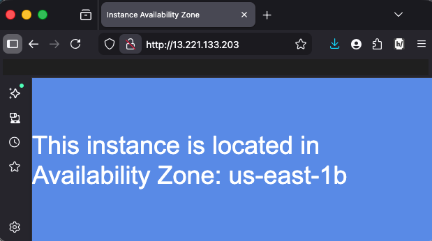

#### Using Access Keys with EC2

The role is assumed by the EC2 instance.
Credentials are not stored on the instance, it is not a good practice beacuse is not secure.
`cat credentials`
For removing the credentials we can run `rm -rf ~/.aws/*`

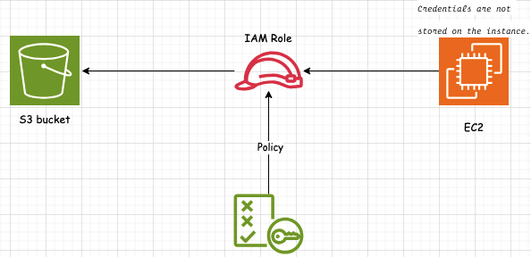

### AMI (Amazon Machine Image)

An Amazon Machine Image define which operating system we want to use and how it is configured. An AMI defines the configuration of the instance.

### AWS Batch

AWS Batch helps you to run batch computing workloads on the AWS Cloud. Batch computing is a common way for developers, scientists, and engineers to access large amounts of compute resources. AWS Batch removes the undifferentiated heavy lifting of configuring and managing the required infrastructure, similar to traditional batch computing software. This service can efficiently provision resources in response to jobs submitted in order to eliminate capacity constraints, reduce compute costs, and deliver results quickly.

A job is an unit of work such as a shell script, executable or Docker container image.

Batch launches, manages, and terminates resources as required (EC2, ECS/Fargate).

### AWS LightSail

Amazon Lightsail is the easiest way to get started with Amazon Web Services (AWS) for anyone who needs to build websites or web applications. It includes everything you need to launch your project quickly—instances (virtual private servers), container services, managed databases, content delivery network (CDN) distributions, load balancers, SSD-based block storage, static IP addresses, DNS management of registered domains, and resource snapshots (backups)—for a low, predictable monthly price.

### AWS Elastic Container Service (ECS)

Amazon Elastic Container Service (Amazon ECS) is a highly scalable and fast container management service that makes it easy to run, stop, and manage containers on a cluster.

An ***Amazon Cluster*** is a logical grouping of ***taks*** or ***services***.
An ECS Task is a running Docker container. An ECS Task is created from a task defintion.

#### ECS Components

- *Cluster*: Logical grouping of tasks of services
- *Container instance*: EC2 instance running the ECS agent
- *Task Definition*: Blueprint that describes how a docker container should launch
- *Task*: A running instance of a task definition
- *Image*: A Docker image referenced in the task definition
- *Service*: Defines long running tasks - can control task count with auto scaling and attch an ELB

#### Launch Types - EC2 and Fargate

##### EC2

- You explicity provision EC2 instances
- You're responsible for managing EC2 instances
- Charged per running EC2 instance
- EFS, FSx and EBS integration
- You handle cluster optimization
- More granular control over infrastructure

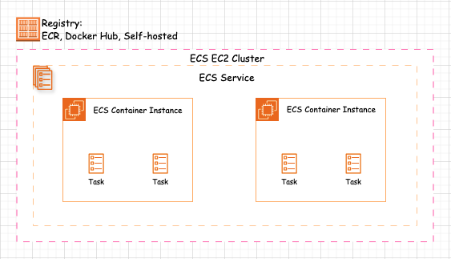

##### Fargate

- Fargate automatically provisions resources
- Fargate provisions and manage compute
- Charged for running tasks
- EFS integration only
- Fargate handles cluster optimization
- Limited control over infrastructure

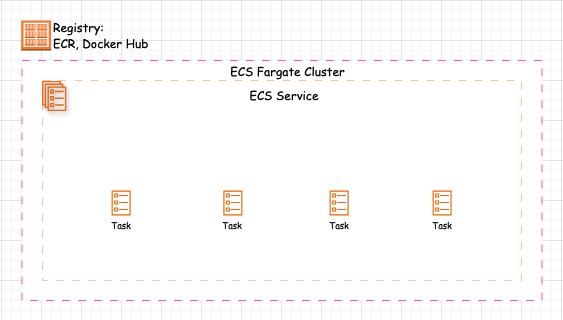

*Note*: With the fargate launch type the container instance role is replaced with the ***Task Excution Role***.

##### ECS and IAM Roles

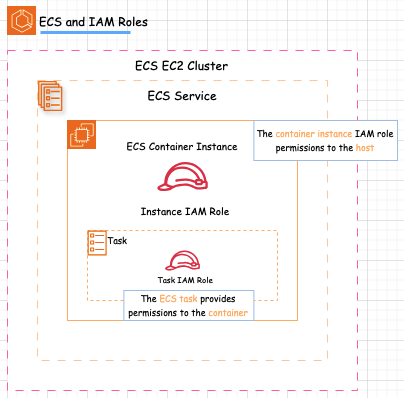

### Amazon Elastic Container Registry (ECR)

Amazon Elastic Container Registry (ECR) is a fully managed container registry that makes it easy to store, manage, share, and deploy your container images and artifacts anywhere.
Docker images can be stored in Amazon ECR
ECR supports private docker repositories with resources-based permissions using AWS IAM.

### Amazon Fargate

AWS Fargate is a technology that you can use with Amazon ECS to run containers without having to manage servers or clusters of Amazon EC2 instances. With AWS Fargate, you no longer have to provision, configure, or scale clusters of virtual machines to run containers.

## AWS Storage Services

### Amazon Elastic Block Store (EBS)

Amazon Elastic Block Store (Amazon EBS) provides scalable, high-performance block storage resources that can be used with Amazon Elastic Compute Cloud (Amazon EC2) instances. With Amazon Elastic Block Store, you can create and manage the following block storage resources:

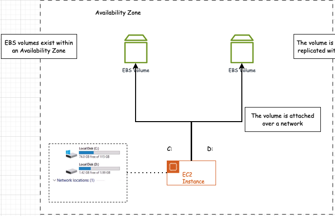

#### Amazon EBS volumes

These are storage volumes that you attach to Amazon EC2 instances. After you attach a volume to an instance, you can use it in the same way you would use a local hard drive attached (HDD or SSD) to a computer, for example to store files or to install applications.

##### IOPS

The requested number of I/O operations per second that the volume can support. It is applicable to Provisioned IOPS SSD (io1) and General Purpose SSD (gp2 and gp3) volumes only.

Check the volumes inside EC2 instance.

```bash
[ec2-user@ip-172-31-93-75 ~]$ sudo lsblk -e7
NAME      MAJ:MIN RM SIZE RO TYPE MOUNTPOINTS
xvda      202:0    0   8G  0 disk
├─xvda1   202:1    0   8G  0 part /
├─xvda127 259:0    0   1M  0 part
└─xvda128 259:1    0  10M  0 part /boot/efi
```

After attaching volume

```bash
[ec2-user@ip-172-31-93-75 ~]$ sudo lsblk -e7
NAME      MAJ:MIN RM SIZE RO TYPE MOUNTPOINTS
xvda      202:0    0   8G  0 disk
├─xvda1   202:1    0   8G  0 part /
├─xvda127 259:0    0   1M  0 part
└─xvda128 259:1    0  10M  0 part /boot/efi
xvdf      202:80   0  10G  0 disk #attached volume
```

#### Amazon EBS snapshots

These are point-in-time backups of Amazon EBS volumes that persist independently from the volume itself. You can create snapshots to back up the data on your Amazon EBS volumes. You can then restore new volumes from those snapshots at any time. Snapshots are a regional contruct beacuse they're in `S3`.

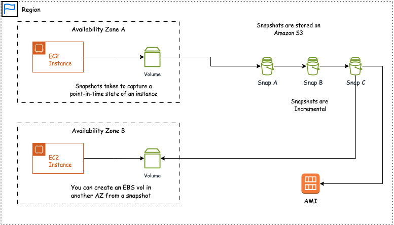

- **Amazon Data Lifecycle Manager (DLM)**
  - DLM automates the creation, retention, and deletion of EBS snapshots and EBS-backed AMIs.
  - DLM helps with the following:
    - Protects valuable data by enforcing a regular backup schedule
    - Create standardized AMIs that can be refreshed at regular intervals
    - Retain backups as required by auditors or internal compliance
    - Reduce storage costs by deleting outdated backups
    - Create disaster recovery backup policies that back up data to isolated accounts

### Amazon Elastic File System (EFS)

Amazon Elastic File System (Amazon EFS) provides serverless, fully elastic file storage so that you can share file data without provisioning or managing storage capacity and performance. Amazon EFS is built to scale on demand to petabytes without disrupting applications, growing and shrinking automatically as you add and remove files. Because Amazon EFS has a simple web services interface, you can create and configure file systems quickly and easily.
Uses the NFS protocol.

#### EFS file system types

Amazon EFS offers Regional and One Zone file system types.

- **Regional** – Regional file systems (recommended) store data redundantly across multiple geographically separated Availability Zones within the same AWS Region.
- **One Zone** – One Zone file systems store data within a single Availability Zone. Storing data in a single Availability Zone provides continuous availability to the data. In the unlikely case of the loss or damage to all or part of the Availability Zone, however, data that is stored in these types of file systems might be lost.

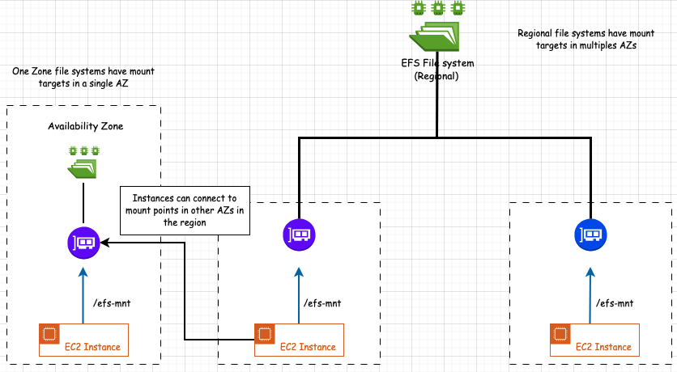

We can replicate EFS in another region for example for disaster recovery purposes. Mount pionts can be created but the file system is read-only.

### Amazon simple storage service (S3)

Amazon Simple Storage Service (Amazon S3) is an object storage service that offers industry-leading scalability, data availability, security, and performance. Customers of all sizes and industries can use Amazon S3 to store and protect any amount of data for a range of use cases, such as data lakes, websites, mobile applications, backup and restore, archive, enterprise applications, IoT devices, and big data analytics. Amazon S3 provides management features so that you can optimize, organize, and configure access to your data to meet your specific business, organizational, and compliance requirements.

A `bucket` is a container for objects. The name of the bucket has to be unique across AWS.
An `object` is a file you upload (pdf, word, png, mp4...). You can store millions of objects in a bucket. An object consist of:

- Key (name of the object)
- Version ID
- Value
- Metadata
- Subresources
- Access control information

Accessing objects in a bucket:

- <https://bucket.s3.aws-region.amazonaws.com/object-key>
- <https://s3.aws-region.amazonaws.com/bucket-name/object-key>

The HTTP protocol is used with a REST API (eg. GET, POST, PUT, DELETE).

#### Amazon S3 Storage Classes

Amazon S3 offers a range of storage classes designed for different use cases. For example, you can store mission-critical production data in S3 Standard or S3 Express One Zone for frequent access, save costs by storing infrequently accessed data in S3 Standard-IA or S3 One Zone-IA, and archive data at the lowest costs in S3 Glacier Instant Retrieval, S3 Glacier Flexible Retrieval, and S3 Glacier Deep Archive.

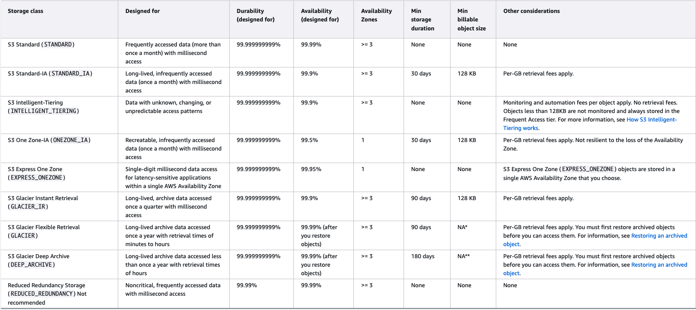

#### Amazon S3 Versioning

- Versioning is a means of keeping multiples variants of an objects in the same bucket
- Use. versioning to preserve, retrieve ans restore every version of every object stored in a bucket
- Versioning-enabled buckets enable you to recover objects from accidental deletion or overwrite

#### Amazon S3 Replication

Cross-Region Replication
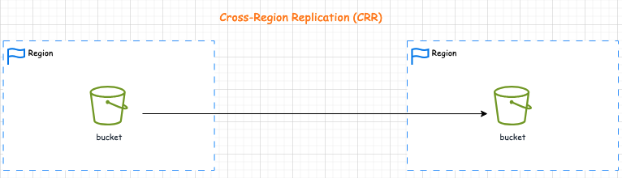

Same-Region Replication
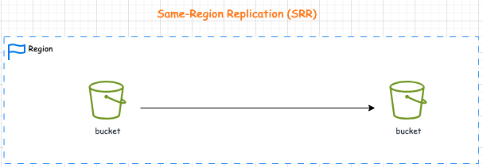

#### Amazon S3 Lifecycle Management

There are two types of actions:

- **Transition actions** - Define when objects transition to another storage class. [Supported transitions](https://docs.aws.amazon.com/AmazonS3/latest/userguide/lifecycle-transition-general-considerations.html)
- **Expiration actions** - Define when objects expire (deleted)

#### Amazon S3 Glacier

Amazon S3 Glacier (S3 Glacier) is a secure and durable service for low-cost data archiving and long-term backup.

### Amazon FSx

Amazon FSx makes it easy and cost effective to launch, run, and scale feature-rich, high-performance file systems in the cloud. It supports a wide range of workloads with its reliability, security, scalability, and broad set of capabilities. With Amazon FSx, you can choose between four widely-used file systems: Lustre, NetApp ONTAP, OpenZFS, and Windows File Server. Amazon File Cache is a high-speed cache on AWS that makes it easier to process file data, regardless of where the data is stored.

### AWS Storage Gateway

AWS Storage Gateway is a service that we can use to connect our on-premises applications into cloud storage for a few different use cases. It is known as a hybrid cloud service because it's connecting you from your on-premises infrastructure.
Use Cases:

- Moving backups to the cloud
- Using on-premises file shares backed by cloud storage
- Low latency access to data in AWS for on-premises applications
- Disaster recovery

### AWS Elastic Disaster Recovery (AWS DRS)

AWS Elastic Disaster Recovery minimizes downtime and data loss with fast, reliable recovery of on-premises and cloud-based applications using affordable storage, minimal compute, and point-in-time recovery.

## DNS, Load Balancing, Auto Scaling

### DNS and Amazon Route 53

Amazon Route 53 is a highly available and scalable Domain Name System (DNS) web service. You can use Route 53 to perform three main functions in any combination: domain registration, DNS routing, and health checking.

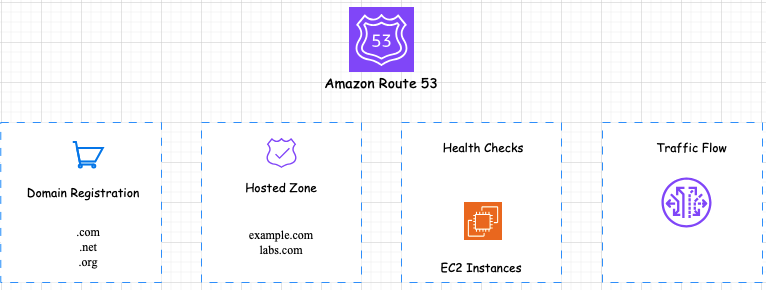

If you choose to use Route 53 for all three functions, be sure to follow the order below:

1. **Register domain names**
  Your website needs a name, such as example.com. Route 53 lets you register a name for your website or web application, known as a domain name.
2. **Route internet traffic to the resources for your domain**
  When a user opens a web browser and enters your domain name (example.com) or subdomain name (acme.example.com) in the address bar, Route 53 helps connect the browser with your website or web application.
3. **Check the health of your resources**
  Route 53 sends automated requests over the internet to a resource, such as a web server, to verify that it's reachable, available, and functional. You also can choose to receive notifications when a resource becomes unavailable and choose to route internet traffic away from unhealthy resources.

### Amazon EC2 Auto Scaling

Amazon EC2 Auto Scaling helps you ensure that you have the correct number of Amazon EC2 instances available to handle the load for your application. You create collections of EC2 instances, called Auto Scaling groups. You can specify the minimum number of instances in each Auto Scaling group, and Amazon EC2 Auto Scaling ensures that your group never goes below this size. You can specify the maximum number of instances in each Auto Scaling group, and Amazon EC2 Auto Scaling ensures that your group never goes above this size.


1. Automatic scaling


1. Maintaining Scaling

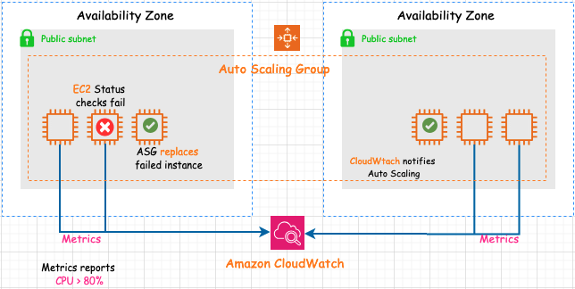

#### Scaling Up vs Scaling Out

- **Scaling UP** means adding resources to the server.
- **Scaling OUT** means adding more instances of the particular application.

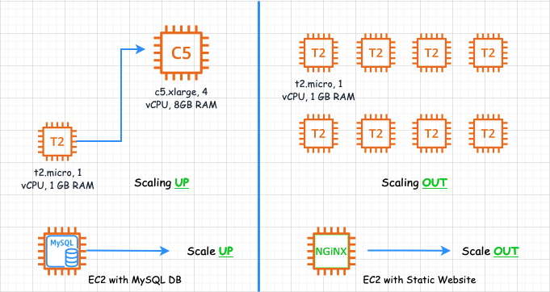

Amazon EC2 auto scaling is horizontal (scales out).

#### Types of Auto Scaling

- **Manual** - Make changes to ASG size manually.
- **Dynamic** - Automatically scales based on demand.
- **Predictive** - Uses machine learning to predict demand.
- **Scheduled** - Scales based on schedule.

#### Create auto scaling groups

1. EC2 - launch templates
2. EC2 - Auto scaling - Use launch template

#### Scaling Policies

- **Target Tracking** - Attempts to keep the group at or close to the metric
- **Step Scaling** - Adjust group based on a metric - adjustments vary based on the size of the alarm breach
- **Simple Scaling** - Adjust group size based on a metric
- **Scheduled Scaling** - Adjust the group size at a specific time

### Amazon Elastic Load Balancer (ELB)

Elastic Load Balancing automatically distributes your incoming traffic across multiple targets, such as EC2 instances, containers, and IP addresses, in one or more Availability Zones. It monitors the health of its registered targets, and routes traffic only to the healthy targets. Elastic Load Balancing scales your load balancer capacity automatically in response to changes in incoming traffic.

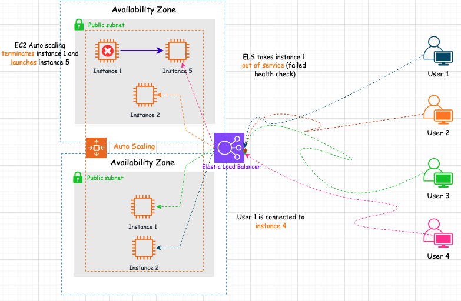

#### Types of Elastic Load Balancer

- **Application Load Balancers**
  - Operates at the request level
  - Routes based on the content of request (L7)
  - Supports path-based routing, hosted-based routing, query string parameter-based routing, and source IP address-based routing
  - Support instances, IP addresses, Lambda functions and container as targets
- **Network Load Balancers**
  - Operates at the connection level
  - Routes connection based on IP protocol data (L4)
  - Offer ultra high performance, low latency and TLS offloading at scale
  - Can have a static IP / Elastic IP
  - Support UDP and static addresses as targets
- **Gateway Load Balancers**
  - Used in front virtual appliances sych as firewalls, ISD/IPS, and deep packet inspection systems
  - Operate at (L3) - listens for all packets on all ports
  - Forwards traffic to the Target Group specified in the listener rules
  - Exchanges traffic with appliances using the GENEVE protocol on port 6081

#### Create Load Balancing

1. Create target group -> to contain de instance
2. Specify group details (Instances, IP address, Lambda, Application Load Balancer)
3. Create Load Balancer
4. Select the auto scaling group, Edit load balancer and select the load balancer target groups
