# AWS Certified Cloud Practitioner CLF-C02

The AWS Certified Cloud Practitioner certification is one of the most popular certifications in cloud computing today. Cloud adoption is growing at an ever increasing rate and a shortage of skilled staff is driving up the value of cloud certifications. It’s important for personnel in many areas of the business to understand the cloud value proposition and how it can drive business value.

## Shared Responsibility Model

The AWS shared responsibility model defines customer/AWS responsibilities.

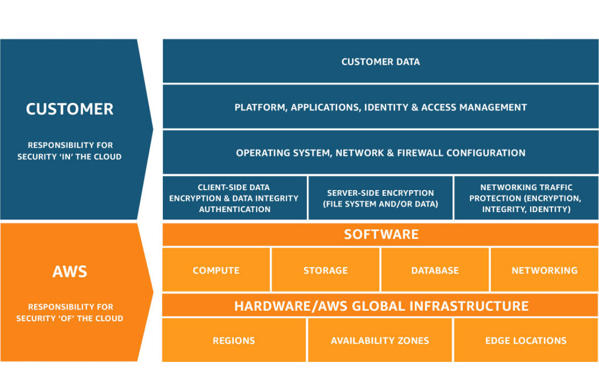

- AWS are responsible for “Security of the Cloud”
  - AWS is responsible for protecting the infrastructure that runs all of the services offered in the AWS Cloud
  - This infrastructure is composed of the hardware, software, networking, and facilities that run AWS Cloud services
- Customers are responsible for “Security in the Cloud”
  - For EC2 this includes network level security, operating system patches and updates, IAM user access management, and client and server-side data encryption

[Docs Shared Responsibility Model](https://aws.amazon.com/compliance/shared-responsibility-model/)

## AWS Pricing

### Pay-as-you-go

With AWS you only pay for what use, helping your organization remain agile, responsive and always able to meet scale demands.

Pay-as-you-go pricing allows you to easily adapt to changing business needs without overcommitting budgets and improving your responsiveness to changes.

### Flat rate

Flat-rate plans combine multiple AWS services into one price with no overage charges, giving you the reliability and security of AWS with simple monthly billing. As your needs grow, you can easily upgrade to plans with more capabilities and larger usage allowances.

### Save when you commit

For AWS Compute and AWS Machine Learning, Savings Plans offer savings over On-Demand in exchange for a commitment to use a specific amount (measured in $/hour) of an AWS service or a category of services, for a one- or three-year period.

### Pay less by using more

With AWS, you can get volume based discounts and realize important savings as your usage increases. For services such as S3 and data transfer OUT from EC2, pricing is tiered, meaning the more you use, the less you pay per GB. In addition, data transfer IN is always free of charge. As a result, as your AWS usage needs increase, you benefit from the economies of scale that allow you to increase adoption and keep costs under control.

[Docs Pricing](https://aws.amazon.com/pricing/)

## Identity and Access Management (IAM)

AWS Identity and Access Management (IAM) is a web service for securely controlling access to AWS services. With IAM, you can centrally manage users, security credentials such as access keys, and permissions that control which AWS resources users and applications can access.

- **Identities**

When you create an AWS account, you begin with one sign-in identity called the AWS account root user that has complete access to all AWS services and resources. AWS strongly recommend that you don't use the root user for everyday tasks.

- **Access management**

After a user is set up in IAM, they use their sign-in credentials to authenticate with AWS. Authentication is provided by matching the sign-in credentials to a principal (an IAM user, AWS STS federated principal, IAM role, or application) trusted by the AWS account.

### AWS Security Token Service (STS)

AWS provides AWS Security Token Service (AWS STS) as a web service that enables you to request temporary, limited-privilege credentials for users. This guide describes the AWS STS API. For more information, see [Temporary Security Credentials](https://docs.aws.amazon.com/IAM/latest/UserGuide/id_credentials_temp.html) in the IAM User Guide.

#### IAM Users

An IAM user is an identity within your AWS account that has specific permissions for a single person or application. For more information, see [IAM users](https://docs.aws.amazon.com/IAM/latest/UserGuide/id_users.html).

#### IAM Groups

An IAM user group is an identity that specifies a collection of IAM users. For more information, see [User groups](https://docs.aws.amazon.com/IAM/latest/UserGuide/id_groups.html).

#### IAM Roles

An IAM role is an identity within your AWS account that has specific permissions. It's similar to an IAM user, but isn't associated with a specific person. For more information, see [IAM roles](https://docs.aws.amazon.com/IAM/latest/UserGuide/id_roles.html).

#### IAM Policies

IAM policies define permissions for an action regardless of the method that you use to perform the operation. For example, if a policy allows the `GetUser` action, then a user with that policy can get user information from the AWS Management Console, the AWS CLI, or the AWS API.

##### Policy types

The following policy types, listed in order from most frequently used to less frequently used, are available for use in AWS.

- **Identity-based policies** – Attach *managed* and *inline* policies to IAM identities (users, groups to which users belong, or roles). Identity-based policies grant permissions to an identity.
- **Resource-based policies** – Attach inline policies to resources. The most common examples of resource-based policies are Amazon S3 bucket policies and IAM role trust policies. Resource-based policies grant permissions to the principal that is specified in the policy. Principals can be in the same account as the resource or in other accounts.
- **Permissions boundaries** – Use a managed policy as the permissions boundary for an IAM entity (user or role). That policy defines the maximum permissions that the identity-based policies can grant to an entity, but does not grant permissions. Permissions boundaries do not define the maximum permissions that a resource-based policy can grant to an entity.
- **AWS Organizations SCPs** – Use an AWS Organizations service control policy (SCP) to define the maximum permissions for IAM users and IAM roles within accounts in your organization or organizational unit (OU). SCPs limit permissions that identity-based policies or resource-based policies grant to IAM users or IAM roles within the account. SCPs do not grant permissions.
- **AWS Organizations RCPs** – Use an AWS Organizations resource control policy (RCP) to define the maximum permissions for resources within accounts in your organization or organizational unit (OU). RCPs limit permissions that identity-based and resource-based policies can grant to resources in accounts within your organization. RCPs do not grant permissions.
- **Access control lists (ACLs)** – Use ACLs to control which principals in other accounts can access the resource to which the ACL is attached. ACLs are similar to resource-based policies, although they are the only policy type that does not use the JSON policy document structure. ACLs are cross-account permissions policies that grant permissions to the specified principal. ACLs cannot grant permissions to entities within the same account.
- **Session policies** – Pass advanced session policies when you use the AWS CLI or AWS API to assume a role or a federated user. Session policies limit the permissions that the role or user's identity-based policies grant to the session. Session policies limit permissions for a created session, but do not grant permissions.

#### Security best practices in IAM

- Require human users to use federation with an identity provider to access AWS using temporary credentials
- Require workloads to use temporary credentials with IAM roles to access AWS
- Require multi-factor authentication (MFA)
- Update access keys when needed for use cases that require long-term credentials
- Follow best practices to protect your root user credentials
- Apply least-privilege permissions
- Get started with AWS managed policies and move toward least-privilege permissions
- Use IAM Access Analyzer to generate least-privilege policies based on access activity
- Regularly review and remove unused users, roles, permissions, policies, and credentials
- Use conditions in IAM policies to further restrict access
- Verify public and cross-account access to resources with IAM Access Analyzer
- Use IAM Access Analyzer to validate your IAM policies to ensure secure and functional permissions
- Establish permissions guardrails across multiple accounts
- Use permissions boundaries to delegate permissions management within an account

The Access key is associated with an IAM accout. The access key will use the **permission** assigned to the IAM account.

## AWS Compute Services

### Amazon Elastic Compute Cloud (EC2)

Create, manage, and monitor virtual servers in the cloud.
Amazon Elastic Compute Cloud `(Amazon EC2)` offers the broadest and deepest compute platform, with over 600 instance types and a choice of the latest processors, storage, networking, operating systems, and purchase models to help you best match the needs of your workload.

#### EC2 Instance Types

| Instance Type | Description | Use Cases |
| :--- | :--- | :--- |
| **General Purpose** | Balanced CPU, memory, and networking resources. | Web servers, code repositories, small databases. |
| **Compute Optimized** | High-performance processors for compute-intensive tasks. | Batch processing, media transcoding, high-performance web servers. |
| **Memory Optimized** | Fast performance for workloads that process large data sets in memory. | High-performance databases, real-time big data analytics. |
| **Accelerated Computing** | Use hardware accelerators (GPUs/FPGAs) for co-processing. | Machine learning, floating-point number calculations, graphics processing. |
| **Storage Optimized** | Designed for workloads that require high, sequential read/write access to large datasets. | NoSQL databases, data warehousing, distributed file systems. |

| Family | Type | vCPUs | Memory (GB) |
| :--- | :--- | :--- | :--- |
| General Propuse | t2.micro | 1 | 1 |
| Compute Optimized | c5n.large | 2 | 5.25 |
| Memory Optimized | r5ad.large | 2 | 16 |
| Storage Optimized | d2.xlarge | 4 | 30.5 |
| Accelerated Computing | g2.2xlarge | 8 | 15 |

#### EC2 Pricing Models

| Model | Description | Best For |
| :--- | :--- | :--- |
| **On-Demand** | Pay by the second for the instances you launch. | Short-term, unpredictable workloads that cannot be interrupted. |
| **Savings Plans** | Commit to a consistent amount of usage (USD/hr) for 1 or 3 years. | Long-term workloads with flexible instance configurations. |
| **Reserved Instances** | Commit to a specific instance configuration for 1 or 3 years. | Steady-state usage with predictable performance requirements. |
| **Spot Instances** | Request unused EC2 capacity at steep discounts (up to 90%). | Fault-tolerant, flexible applications (e.g., batch jobs, background processing). |
| **Dedicated Hosts** | Physical servers with EC2 instance capacity fully dedicated to your use. | Compliance requirements or server-bound software licenses (BYOL). |

#### EC2 Metadata

- Instance metada is data about your EC2 instance.

`curl http://169.254.169.254/latest/meta-data/`

1. Get instance ID: `curl http://169.254.169.254/latest/meta-data/instance-id`
2. Get AMI ID `curl http://169.254.169.254/latest/meta-data/ami-id`

```bash
[ec2-user@ip-172-31-23-222 ~]$ nano script.sh #copy and paste web-server.sh
[ec2-user@ip-172-31-23-222 ~]$ chmod +x script.sh
[ec2-user@ip-172-31-23-222 ~]$ ls -la script.sh
-rwxr-xr-x. 1 ec2-user ec2-user 1172 Feb  5 03:13 script.sh
[ec2-user@ip-172-31-23-222 ~]$ sudo ./script.sh
```

Output

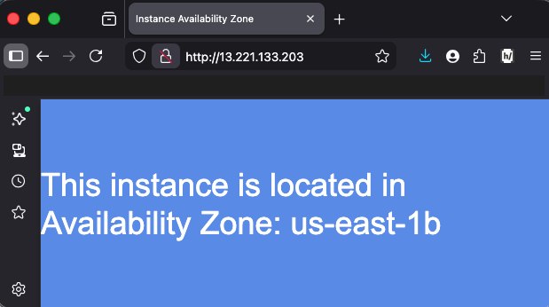

#### Using Access Keys with EC2

The role is assumed by the EC2 instance.
Credentials are not stored on the instance, it is not a good practice beacuse is not secure.
`cat credentials`
For removing the credentials we can run `rm -rf ~/.aws/*`

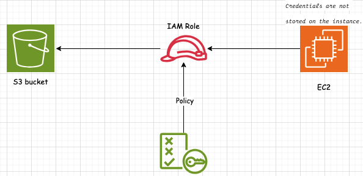

### AMI (Amazon Machine Image)

An Amazon Machine Image define which operating system we want to use and how it is configured. An AMI defines the configuration of the instance.

### AWS Batch

AWS Batch helps you to run batch computing workloads on the AWS Cloud. Batch computing is a common way for developers, scientists, and engineers to access large amounts of compute resources. AWS Batch removes the undifferentiated heavy lifting of configuring and managing the required infrastructure, similar to traditional batch computing software. This service can efficiently provision resources in response to jobs submitted in order to eliminate capacity constraints, reduce compute costs, and deliver results quickly.

A job is an unit of work such as a shell script, executable or Docker container image.

Batch launches, manages, and terminates resources as required (EC2, ECS/Fargate).

### AWS LightSail

Amazon Lightsail is the easiest way to get started with Amazon Web Services (AWS) for anyone who needs to build websites or web applications. It includes everything you need to launch your project quickly—instances (virtual private servers), container services, managed databases, content delivery network (CDN) distributions, load balancers, SSD-based block storage, static IP addresses, DNS management of registered domains, and resource snapshots (backups)—for a low, predictable monthly price.

### AWS Elastic Container Service (ECS)

Amazon Elastic Container Service (Amazon ECS) is a highly scalable and fast container management service that makes it easy to run, stop, and manage containers on a cluster.

An ***Amazon Cluster*** is a logical grouping of ***taks*** or ***services***.
An ECS Task is a running Docker container. An ECS Task is created from a task defintion.

#### ECS Components

- *Cluster*: Logical grouping of tasks of services
- *Container instance*: EC2 instance running the ECS agent
- *Task Definition*: Blueprint that describes how a docker container should launch
- *Task*: A running instance of a task definition
- *Image*: A Docker image referenced in the task definition
- *Service*: Defines long running tasks - can control task count with auto scaling and attch an ELB

#### Launch Types - EC2 and Fargate

##### EC2

- You explicity provision EC2 instances
- You're responsible for managing EC2 instances
- Charged per running EC2 instance
- EFS, FSx and EBS integration
- You handle cluster optimization
- More granular control over infrastructure

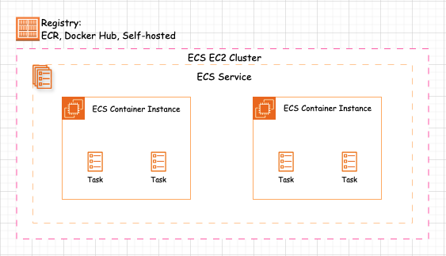

##### Fargate

- Fargate automatically provisions resources
- Fargate provisions and manage compute
- Charged for running tasks
- EFS integration only
- Fargate handles cluster optimization
- Limited control over infrastructure

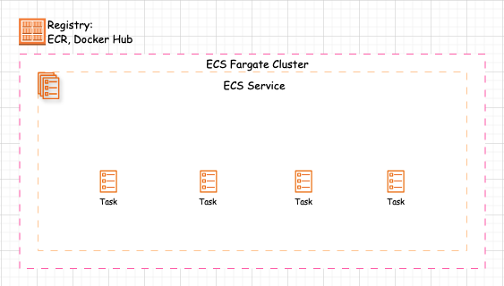

*Note*: With the fargate launch type the container instance role is replaced with the ***Task Excution Role***.

##### ECS and IAM Roles

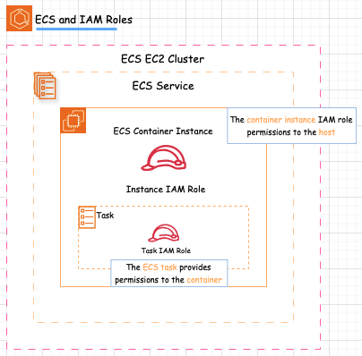

### Amazon Elastic Container Registry (ECR)

Amazon Elastic Container Registry (ECR) is a fully managed container registry that makes it easy to store, manage, share, and deploy your container images and artifacts anywhere.
Docker images can be stored in Amazon ECR
ECR supports private docker repositories with resources-based permissions using AWS IAM.

### Amazon Fargate

AWS Fargate is a technology that you can use with Amazon ECS to run containers without having to manage servers or clusters of Amazon EC2 instances. With AWS Fargate, you no longer have to provision, configure, or scale clusters of virtual machines to run containers.

## AWS Storage Services

### Amazon Elastic Block Store (EBS)

Amazon Elastic Block Store (Amazon EBS) provides scalable, high-performance block storage resources that can be used with Amazon Elastic Compute Cloud (Amazon EC2) instances. With Amazon Elastic Block Store, you can create and manage the following block storage resources:

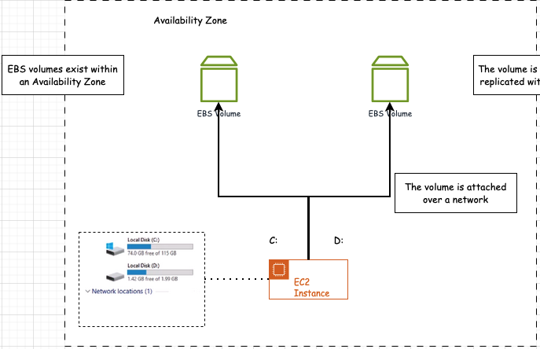

#### Amazon EBS volumes

These are storage volumes that you attach to Amazon EC2 instances. After you attach a volume to an instance, you can use it in the same way you would use a local hard drive attached (HDD or SSD) to a computer, for example to store files or to install applications.

##### IOPS

The requested number of I/O operations per second that the volume can support. It is applicable to Provisioned IOPS SSD (io1) and General Purpose SSD (gp2 and gp3) volumes only.

Check the volumes inside EC2 instance.

```bash
[ec2-user@ip-172-31-93-75 ~]$ sudo lsblk -e7
NAME      MAJ:MIN RM SIZE RO TYPE MOUNTPOINTS
xvda      202:0    0   8G  0 disk
├─xvda1   202:1    0   8G  0 part /
├─xvda127 259:0    0   1M  0 part
└─xvda128 259:1    0  10M  0 part /boot/efi
```

After attaching volume

```bash
[ec2-user@ip-172-31-93-75 ~]$ sudo lsblk -e7
NAME      MAJ:MIN RM SIZE RO TYPE MOUNTPOINTS
xvda      202:0    0   8G  0 disk
├─xvda1   202:1    0   8G  0 part /
├─xvda127 259:0    0   1M  0 part
└─xvda128 259:1    0  10M  0 part /boot/efi
xvdf      202:80   0  10G  0 disk #attached volume
```

#### Amazon EBS snapshots

These are point-in-time backups of Amazon EBS volumes that persist independently from the volume itself. You can create snapshots to back up the data on your Amazon EBS volumes. You can then restore new volumes from those snapshots at any time. Snapshots are a regional contruct beacuse they're in `S3`.

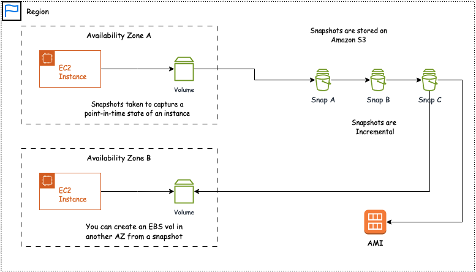

- **Amazon Data Lifecycle Manager (DLM)**
  - DLM automates the creation, retention, and deletion of EBS snapshots and EBS-backed AMIs.
  - DLM helps with the following:
    - Protects valuable data by enforcing a regular backup schedule
    - Create standardized AMIs that can be refreshed at regular intervals
    - Retain backups as required by auditors or internal compliance
    - Reduce storage costs by deleting outdated backups
    - Create disaster recovery backup policies that back up data to isolated accounts

### Amazon Elastic File System (EFS)

Amazon Elastic File System (Amazon EFS) provides serverless, fully elastic file storage so that you can share file data without provisioning or managing storage capacity and performance. Amazon EFS is built to scale on demand to petabytes without disrupting applications, growing and shrinking automatically as you add and remove files. Because Amazon EFS has a simple web services interface, you can create and configure file systems quickly and easily.
Uses the NFS protocol.

#### EFS file system types

Amazon EFS offers Regional and One Zone file system types.

- **Regional** – Regional file systems (recommended) store data redundantly across multiple geographically separated Availability Zones within the same AWS Region.
- **One Zone** – One Zone file systems store data within a single Availability Zone. Storing data in a single Availability Zone provides continuous availability to the data. In the unlikely case of the loss or damage to all or part of the Availability Zone, however, data that is stored in these types of file systems might be lost.

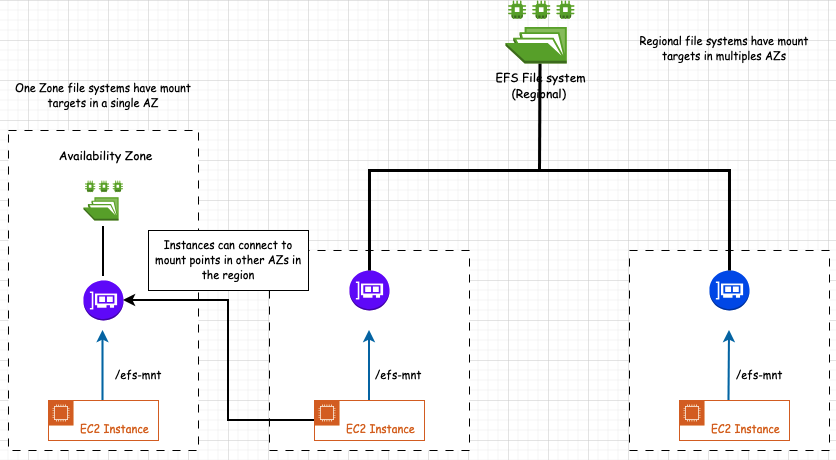

We can replicate EFS in another region for example for disaster recovery purposes. Mount pionts can be created but the file system is read-only.

### Amazon simple storage service (S3)

Amazon Simple Storage Service (Amazon S3) is an object storage service that offers industry-leading scalability, data availability, security, and performance. Customers of all sizes and industries can use Amazon S3 to store and protect any amount of data for a range of use cases, such as data lakes, websites, mobile applications, backup and restore, archive, enterprise applications, IoT devices, and big data analytics. Amazon S3 provides management features so that you can optimize, organize, and configure access to your data to meet your specific business, organizational, and compliance requirements.

A `bucket` is a container for objects. The name of the bucket has to be unique across AWS.
An `object` is a file you upload (pdf, word, png, mp4...). You can store millions of objects in a bucket. An object consist of:

- Key (name of the object)
- Version ID
- Value
- Metadata
- Subresources
- Access control information

Accessing objects in a bucket:

- <https://bucket.s3.aws-region.amazonaws.com/object-key>
- <https://s3.aws-region.amazonaws.com/bucket-name/object-key>

The HTTP protocol is used with a REST API (eg. GET, POST, PUT, DELETE).

#### Amazon S3 Storage Classes

Amazon S3 offers a range of storage classes designed for different use cases. For example, you can store mission-critical production data in S3 Standard or S3 Express One Zone for frequent access, save costs by storing infrequently accessed data in S3 Standard-IA or S3 One Zone-IA, and archive data at the lowest costs in S3 Glacier Instant Retrieval, S3 Glacier Flexible Retrieval, and S3 Glacier Deep Archive.

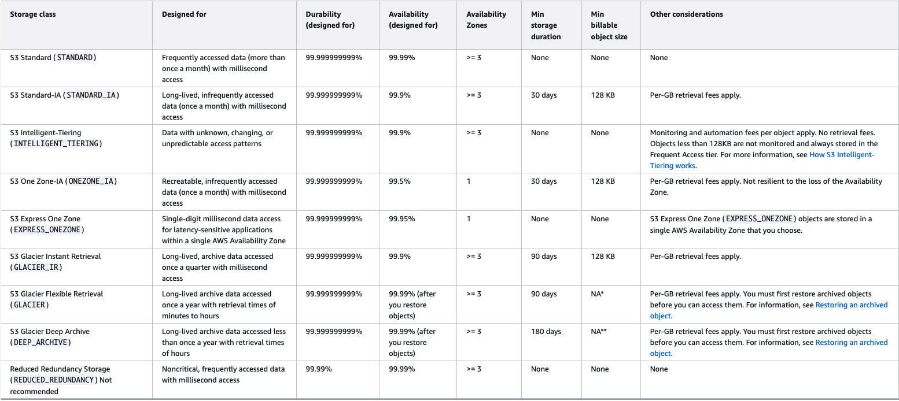

#### Amazon S3 Versioning

- Versioning is a means of keeping multiples variants of an objects in the same bucket
- Use. versioning to preserve, retrieve ans restore every version of every object stored in a bucket
- Versioning-enabled buckets enable you to recover objects from accidental deletion or overwrite

#### Amazon S3 Replication

Cross-Region Replication
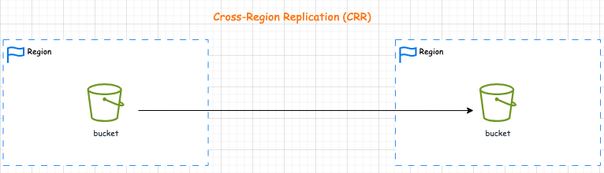

Same-Region Replication
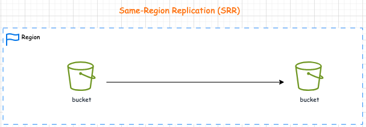

#### Amazon S3 Lifecycle Management

There are two types of actions:

- **Transition actions** - Define when objects transition to another storage class. [Supported transitions](https://docs.aws.amazon.com/AmazonS3/latest/userguide/lifecycle-transition-general-considerations.html)
- **Expiration actions** - Define when objects expire (deleted)

#### Amazon S3 Glacier

Amazon S3 Glacier (S3 Glacier) is a secure and durable service for low-cost data archiving and long-term backup.

### Amazon FSx

Amazon FSx makes it easy and cost effective to launch, run, and scale feature-rich, high-performance file systems in the cloud. It supports a wide range of workloads with its reliability, security, scalability, and broad set of capabilities. With Amazon FSx, you can choose between four widely-used file systems: Lustre, NetApp ONTAP, OpenZFS, and Windows File Server. Amazon File Cache is a high-speed cache on AWS that makes it easier to process file data, regardless of where the data is stored.

### AWS Storage Gateway

AWS Storage Gateway is a service that we can use to connect our on-premises applications into cloud storage for a few different use cases. It is known as a hybrid cloud service because it's connecting you from your on-premises infrastructure.
Use Cases:

- Moving backups to the cloud
- Using on-premises file shares backed by cloud storage
- Low latency access to data in AWS for on-premises applications
- Disaster recovery

### AWS Elastic Disaster Recovery (AWS DRS)

AWS Elastic Disaster Recovery minimizes downtime and data loss with fast, reliable recovery of on-premises and cloud-based applications using affordable storage, minimal compute, and point-in-time recovery.

## DNS, Load Balancing, Auto Scaling

### DNS and Amazon Route 53

Amazon Route 53 is a highly available and scalable Domain Name System (DNS) web service. You can use Route 53 to perform three main functions in any combination: domain registration, DNS routing, and health checking.

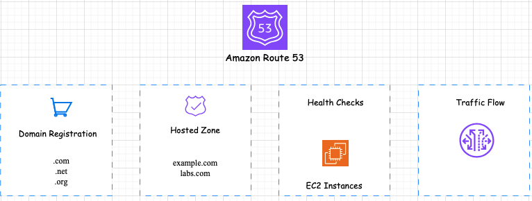

If you choose to use Route 53 for all three functions, be sure to follow the order below:

1. **Register domain names**
  Your website needs a name, such as example.com. Route 53 lets you register a name for your website or web application, known as a domain name.
2. **Route internet traffic to the resources for your domain**
  When a user opens a web browser and enters your domain name (example.com) or subdomain name (acme.example.com) in the address bar, Route 53 helps connect the browser with your website or web application.
3. **Check the health of your resources**
  Route 53 sends automated requests over the internet to a resource, such as a web server, to verify that it's reachable, available, and functional. You also can choose to receive notifications when a resource becomes unavailable and choose to route internet traffic away from unhealthy resources.

### Amazon EC2 Auto Scaling

Amazon EC2 Auto Scaling helps you ensure that you have the correct number of Amazon EC2 instances available to handle the load for your application. You create collections of EC2 instances, called Auto Scaling groups. You can specify the minimum number of instances in each Auto Scaling group, and Amazon EC2 Auto Scaling ensures that your group never goes below this size. You can specify the maximum number of instances in each Auto Scaling group, and Amazon EC2 Auto Scaling ensures that your group never goes above this size.

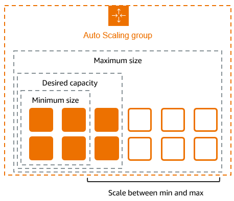

1. Automatic scaling

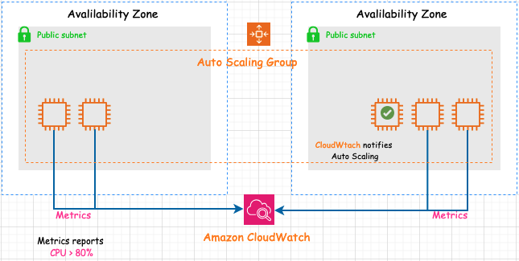

1. Maintaining Scaling

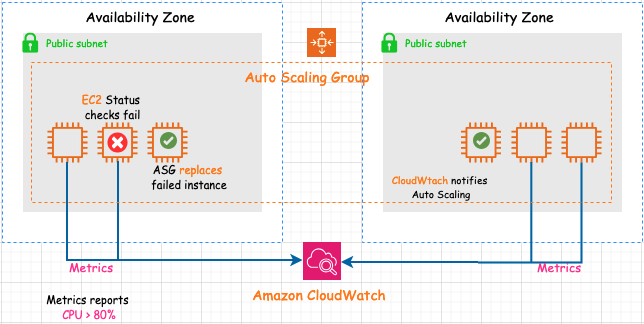

#### Scaling Up vs Scaling Out

- **Scaling UP** means adding resources to the server.
- **Scaling OUT** means adding more instances of the particular application.

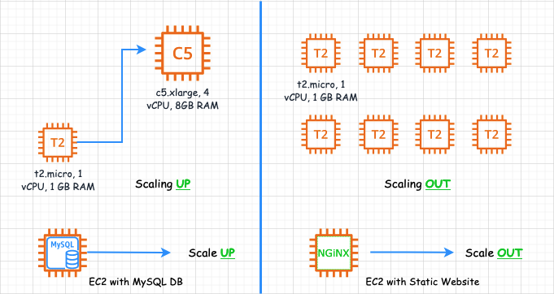

Amazon EC2 auto scaling is horizontal (scales out).

#### Types of Auto Scaling

- **Manual** - Make changes to ASG size manually.
- **Dynamic** - Automatically scales based on demand.
- **Predictive** - Uses machine learning to predict demand.
- **Scheduled** - Scales based on schedule.

#### Create auto scaling groups

1. EC2 - launch templates
2. EC2 - Auto scaling - Use launch template

#### Scaling Policies

- **Target Tracking** - Attempts to keep the group at or close to the metric
- **Step Scaling** - Adjust group based on a metric - adjustments vary based on the size of the alarm breach
- **Simple Scaling** - Adjust group size based on a metric
- **Scheduled Scaling** - Adjust the group size at a specific time

### Amazon Elastic Load Balancer (ELB)

Elastic Load Balancing automatically distributes your incoming traffic across multiple targets, such as EC2 instances, containers, and IP addresses, in one or more Availability Zones. It monitors the health of its registered targets, and routes traffic only to the healthy targets. Elastic Load Balancing scales your load balancer capacity automatically in response to changes in incoming traffic.

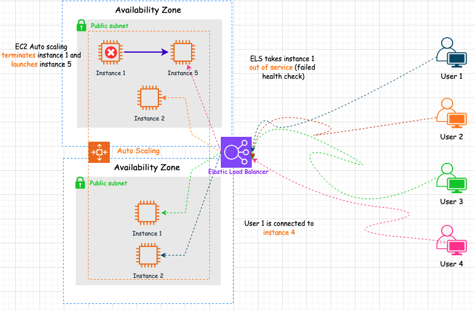

#### Types of Elastic Load Balancer

- **Application Load Balancers**
  - Operates at the request level
  - Routes based on the content of request (L7)
  - Supports path-based routing, hosted-based routing, query string parameter-based routing, and source IP address-based routing
  - Support instances, IP addresses, Lambda functions and container as targets
- **Network Load Balancers**
  - Operates at the connection level
  - Routes connection based on IP protocol data (L4)
  - Offer ultra high performance, low latency and TLS offloading at scale
  - Can have a static IP / Elastic IP
  - Support UDP and static addresses as targets
- **Gateway Load Balancers**
  - Used in front virtual appliances sych as firewalls, ISD/IPS, and deep packet inspection systems
  - Operate at (L3) - listens for all packets on all ports
  - Forwards traffic to the Target Group specified in the listener rules
  - Exchanges traffic with appliances using the GENEVE protocol on port 6081

#### Create Load Balancing

1. Create target group -> to contain de instance
2. Specify group details (Instances, IP address, Lambda, Application Load Balancer)
3. Create Load Balancer
4. Select the auto scaling group, Edit load balancer and select the load balancer target groups

## Application Service

### AWS Lambda

With AWS Lambda, you can run code without provisioning or managing servers. You pay only for the compute time that you consume—there's no charge when your code isn't running. You can run code for virtually any type of application or backend service—all with zero administration. Just upload your code and Lambda takes care of everything required to run and scale your code with high availability.

### Amazon Simple Queue Services (SQS)

Amazon Simple Queue Service (Amazon SQS) is a fully managed message queuing service that makes it easy to decouple and scale microservices, distributed systems, and serverless applications. Amazon SQS moves data between distributed application components and helps you decouple these components.

### Amazon Simple Notification Service (SNS)

Amazon Simple Notification Service (Amazon SNS) is a web service that enables applications, end-users, and devices to instantly send and receive notifications from the cloud.

### Amazon EventBridge

Amazon EventBridge is a serverless event bus service that makes it easy to connect your applications with data from a variety of sources. EventBridge delivers a stream of real-time data from your own applications, software-as-a-service (SaaS) applications, and AWS services and routes that data to targets such as AWS Lambda. You can set up routing rules to determine where to send your data to build application architectures that react in real time to all of your data sources. EventBridge enables you to build event-driven architectures that are loosely coupled and distributed.

### AWS Step Functions

AWS Step Functions makes it easy to coordinate the components of distributed applications as a series of steps in a visual workflow. You can quickly build and run state machines to execute the steps of your application in a reliable and scalable fashion.

### Amazon MQ

Amazon MQ is a managed message broker service that makes it easy to set up and operate message brokers in the cloud. Amazon MQ provides interoperability with your existing applications and services. Amazon MQ works with your existing applications and services without the need to manage, operate, or maintain your own messaging system.

#### Comparison of Application Integration Services

| Service | Type | Key Feature | Example use cases |
| :--- | :--- | :--- | :--- |
| **Amazon SQS** | Queue | Decouples applications using a pull-based buffer. | Building distributed / decoupled applications |
| **Amazon SNS** | Pub/Sub | Push-based notifications to many subscribers (Topic). | Send email notification when CloudWatch alarms is triggered |
| **Amazon EventBridge** | Event Bus | Routes events from AWS, SaaS, or custom apps. | Create event driven applications |
| **AWS Step Functions** | Workflow | Orchestrates multiple services into a visual workflow. | Order processing workflows |
| **Amazon MQ** | Managed Broker | Compatibility for existing apps (ActiveMQ/RabbitMQ). | Need a message queue that supports industry standard APIs protocols |

### Amazon CloudWatch

Amazon CloudWatch provides a reliable, scalable, and flexible monitoring solution that you can start using within minutes. You no longer need to set up, manage, and scale your own monitoring systems and infrastructure.

### Amazon API Gateway

Amazon API Gateway enables you to create and deploy your own REST and WebSocket APIs at any scale. You can create robust, secure, and scalable APIs that access Amazon Web Services or other web services, as well as data that’s stored in the AWS Cloud. You can create APIs to use in your own client applications, or you can make your APIs available to third-party app developers.

## Amazon VPC - Networking - Hybrid

### Amazon Virtual Private Cloud (VPC)

Amazon Virtual Private Cloud (Amazon VPC) enables you to provision a logically isolated section of the AWS Cloud where you can launch AWS resources in a virtual network that you've defined.

A `VPC` is a logically isolated portion of the AWS Cloud within a region. You can create subnets and those are actually mapped to availability zones.
You can launch EC2 instances into your VPC subnets.
An Internet Gateway is used to connect to the Internet.
The route table is used to configure the VPC router.
You can create multiples VPCS within each region. Each VPC has a different block of Ip address.

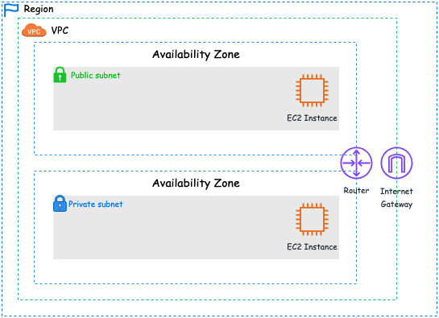

#### CIDR - Classes Inter-Domain Routing

Stand for Classes Inter-Domain Routing. Each subnet has a block of IP address from the CIDR block.
VPC has a CIDR `10.0.0.0/16`.
Public subnet has a CIDR  `10.0.1.0/24`
Private subnet has a CIDR `10.0.2.0/24`

#### Security Groups and Network ACLs

- **Security Group**
  - Operates at the instance level
  - Support allow rules only
  - Stateful
  - Evaluates all rules
  - Applies to an instance only if associated with group
- **Network ACL**
  - Operates at the subnet level
  - Support allow and deny rules
  - Stateless
  - Process rules in order
  - Automatically applies to all instances in the subnets its associated with

#### Public, Private and Elastic Addresses

- Public
  - Lost when the instance is stopped
  - Used in Public Subnets
  - No charge
  - Associated with a private IP address on the instance
  - Cannot be moved between instances
- Private
  - Retained when the instance is stopped
  - Used in Public and Private Subnets
- Elastic
  - Static public IP address
  - Your are charged if not used
  - Associated with a private IP address on the instance
  - Can be moved between instances and Elastic Network Adapters

#### NAT Gateway and NAT Instances - NAT (Network Address Translation)

A *NAT gateway* is a Network Address Translation (NAT) service. You can use a NAT gateway so that instances in a private subnet can connect to services outside your VPC but external services can't initiate a connection with those instances.
The NAT Gateway is created in the public subnet.

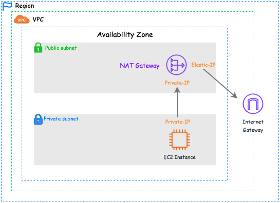

*NAT Instances* is the old way of doing thing before the actual NAT Gateways even existed. You can use a NAT instance to allow resources in a private subnet to communicate with destinations outside the virtual private cloud (VPC), such as the internet or an on-premises network.
The route table associated with the private subnet sends internet traffic from the instances in the private subnet to the NAT instance in the public subnet. The NAT instance then sends the traffic to the internet gateway.

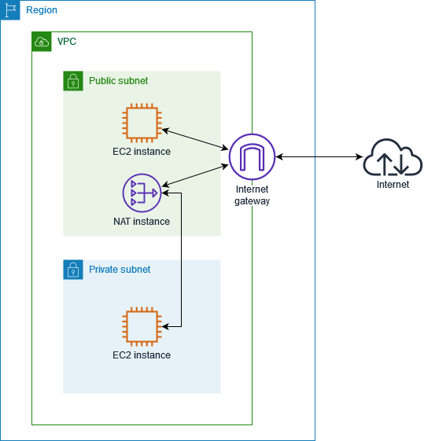

### Amazon VPC Peering

A VPC peering connection is a networking connection between two VPCs that enables you to route traffic between them using private IPv4 addresses or IPv6 addresses. Instances in either VPC can communicate with each other as if they are within the same network. You can create a VPC peering connection between your own VPCs, or with a VPC in another AWS account. The VPCs can be in different Regions (also known as an inter-Region VPC peering connection).
Cannot overlap their CIDR. VPC peering connections are not transitive, full mesh required. The connection has to be direct.

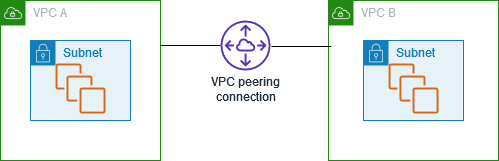

### Amazon VPN (Site-to-Site VPN)

AWS Virtual Private Network (Site-to-Site VPN) establishes a secure and private tunnel from your network or device to the AWS Cloud. You can extend your existing on-premises network into a VPC, or connect to other AWS resources from a client. Site-to-Site VPN offers two types of private connectivity that feature the high availability and robust security necessary for your data.

By default, an instance that you launch within an Amazon VPC can't communicate with a local (AWS Cloud) network and a remote device — for example, this might be a site or an on-premises device. You can enable access to your remote devices from your VPC by creating an AWS Site-to-Site VPN (Site-to-Site VPN) connection, and configuring routing to pass traffic through the connection.
Use the public Internet.

### Amazon Direct Connect

Direct Connect establishes a dedicated network connection between your on-premises network and AWS. With this connection in place, you can create virtual interfaces directly to the AWS Cloud, bypassing your internet service provider. This can provide a more consistent network experience. It is more expensive than having a VPN. If you have enough data that you're transferring it can be cost effective as well as being high performance.
Direct connect is Private that means you get consistent network experience, whereas a VPN is Public.

### AWS Transit Gateway

Transit Gateway is a network transit hub that interconnects VPCs and on-premises networks. As your cloud infrastructure expands globally, inter-Region peering connects transit gateways together using the AWS Global Infrastructure. All network traffic between AWS data centers is automatically encrypted at the physical layer.

### AWS Outposts

AWS Outposts is a fully managed service that extends AWS infrastructure, services, APIs, and tools to customer premises. By providing local access to AWS managed infrastructure, AWS Outposts enables customers to build and run applications on premises using the same programming interfaces as in AWS Regions, while using local compute and storage resources for lower latency and local data processing needs.

## Deployment and Automation

### Amazon CloudFront

Amazon CloudFront is a content delivery network (CDN) service. Amazon CloudFront speeds up distribution of your static and dynamic web content, such as .html, .css, .php, image, and media files. When users request your content, CloudFront delivers it through a worldwide network of edge locations that provide low latency and high performance.
CDNs improve performance by caching content closer to users.

- Uses HTTPs and intrgrates with AWS ACM (Certificate Manager) for managing SSL/TLS certificates
- Integrates with AWS Shield and AWS WAF (Web Application Firewall) for additional security protection
- Content can also protected with features including signed cookies, signed URLs, and origin access identity (OAI)

### AWS Global Accelerator

AWS Global Accelerator is a service in which you create accelerators to improve the performance of your applications for local and global users. Depending on the type of accelerator you choose.
Global Accelerator is a global service that supports endpoints in multiple AWS Regions. To determine if Global Accelerator or other services are currently supported in a specific AWS Region.

- Network Layer: Operates at the network layer (Layer 4 of the OSI model)
- IP Address: Provides static IP addresses as a fixed entry point your applications
- Performance: Improves performance by leveraging the AWS Global Network Backbone, reducing internet latency and jitter
- Health Checks: Perform health checks and automatically reroutes traffic to healthy endpoints
- Application Protocols: Supports TCP and UDP traffic

### IaC with AWS CloudFormation

With Infrastructure as Code (IaC), you can automate the deployment and management of your AWS resources, including serverless applications. IaC allows you to define your infrastructure using code, making it easier to version, share, and replicate your deployments. This approach helps you:

- Speed up your development cycle
- Simplify configuration management
- Improve reliability and consistency of your deployments

AWS CloudFormation enables you to create and provision AWS infrastructure deployments predictably and repeatedly. It helps you leverage AWS products such as Amazon EC2, Amazon Elastic Block Store, Amazon SNS, Elastic Load Balancing, and Auto Scaling to build highly reliable, highly scalable, cost-effective applications in the cloud without worrying about creating and configuring the underlying AWS infrastructure. AWS CloudFormation enables you to use a template file to create and delete a collection of resources together as a single unit (a stack).
Infrastructure patterns are defined in template file (`json`, `yaml`) using code.

| Component | Description |
| :--- | :--- |
| Templates | The JSON or YAML text file that contains the instructions for building out the AWS enviroment |
| Stack | The entire enviroment described by the template and created, updated, and deleted as single unit |
| StackSets | AWS CloudFormation StackSets extends the functionality of stacks by enabling you to create, update, or delete stacks accross multiples accounts and regions with single operation |
| Change Sets | A summary of proposed changes to your stack that will allow you to see how these changes might impact your existing resources before implementing them |

### AWS Cloud Development Kit (CDK)

The AWS Cloud Development Kit (AWS CDK) is an open-source software development framework for defining cloud infrastructure in code and provisioning it through AWS CloudFormation.
Enables you to model application infrastructure using TypeScript, Python, Java and .NET

### PaaS with Elastic Beanstalk

With Elastic Beanstalk you can deploy web applications into the AWS Cloud on a variety of supported platforms. You build and deploy your applications. Elastic Beanstalk provisions Amazon EC2 instances, configures load balancing, sets up health monitoring, and dynamically scales your environment.

In addition to web server environments, Elastic Beanstalk also provides worker environments which you can use to process messages from an Amazon SQS queue, useful for asynchronous or long-running tasks.

- Supports many application platforms including:
  - Java, .NET, Nodejs, PHP, Ruby, Python, Go and Docker
- Use core AWS services including EC2, ECS, Auto Scaling and Elastic Load Balancing
- Elastic Beanstalk provides a UI to monitor and manage the health of application
- Managed platform updates deploy the latest version of software and patches
- Versions can be applied to any environment

#### Web Servers and Workers

- **Web Servers** are standard applications that listen for and then process HTTP requests, typically over port 80
- **Workers** are specialized applications that have a background processing task that listening for messages from an Amazon SQS queue. Should be used for long-running tasks

### AWS Developer Tools (Code*)

The Developer tools are used in continous integration and continuos delivery.

#### Continuous Integration

##### AWS CodeCommit

AWS CodeCommit is a fully managed source control service that makes it easy for companies to host secure and highly scalable private Git repositories. Code repository similar to Github.

##### AWS CodeBuild

AWS CodeBuild is a fully managed build service that compiles source code, runs tests, and produces software packages that are ready to deploy. With CodeBuild, you don’t need to provision, manage, and scale your own build servers. CodeBuild scales continuously and processes multiple builds concurrently, so your builds are not left waiting in a queue.

#### Continuous Delivery

##### AWS CodeDeploy

AWS CodeDeploy is a service that automates code deployments to any instance, including EC2 instances and instances running on premises. CodeDeploy makes it easier for you to rapidly release new features, helps you avoid downtime during application deployment, and handles the complexity of updating your applications. You can use CodeDeploy to automate software deployments, eliminating the need for error-prone manual operations. The service scales with your infrastructure so you can easily deploy to one instance or thousands.

##### AWS CodePipeline

AWS CodePipeline is a fully managed continuous delivery service that helps you automate your release pipelines for fast and reliable application and infrastructure updates. CodePipeline automates the build, test, and deploy phases of your release process every time there is a code change, based on the release model you define. This enables you to rapidly and reliably deliver features and updates. You can easily integrate CodePipeline with third-party services such as GitHub or with your own custom plugin. With AWS CodePipeline, you only pay for what you use. There are no upfront fees or long-term commitments.
It connects these AWS developer tools together and it forms a pipeline.

### AWS Cloud9

AWS Cloud9 is a cloud-based integrated development environment (IDE) that lets you write, run, and debug your code with just a browser. It includes a code editor, debugger, and terminal. AWS Cloud9 comes prepackaged with essential tools for popular programming languages, including JavaScript, Python, PHP, and more, so you don’t need to install files or configure your development machine to start new projects.

### AWS AppConfig

AWS AppConfig feature flags and dynamic configurations help software builders quickly and securely adjust application behavior in production environments without full code deployments. AWS AppConfig speeds up software release frequency, improves application resiliency, and helps you address emergent issues more quickly.

### AWS X-Ray

AWS X-Ray makes it easy for developers to analyze the behavior of their distributed applications by providing request tracing, exception collection, and profiling capabilities.
AWS X-Ray is a service you can use to debug your distributed applications.

- AWS X-Ray supports applications running on:
  - Amazon EC2
  - Amazon ECS
  - AWS Lambda
  - AWS Beanstalk

## Databases and Analitics

Relational Databases: Organized by tables, rows, and columns. Rigid schema SQL. Typically scaled vertically.

Non-Relational Databases: Flexible schema NoSQL - data stored in key-value pair, columns, documents or graphs. Scaled horizontally.

### Amazon Relational Database Service (RDS)

Amazon Relational Database Service (Amazon RDS) is a web service that makes it easier to set up, operate, and scale a relational database in the cloud. It provides cost-efficient, resizeable capacity for an industry-standard relational database and manages common database administration tasks. Amazon Aurora is a fully managed relational database engine that's built for the cloud and compatible with MySQL and PostgreSQL. Amazon Aurora is part of Amazon RDS.

### Amazon Aurora

Amazon Aurora (Aurora) is a fully managed relational database engine that's compatible with MySQL and PostgreSQL. You already know how MySQL and PostgreSQL combine the speed and reliability of high-end commercial databases with the simplicity and cost-effectiveness of open-source databases.
Aurora is up to five times faster than standard MySQL databases and three times faster than standard PostgreSQL databases.

### Amazon Aurora DB clusters

An Amazon Aurora DB cluster consists of one or more DB instances and a cluster volume that manages the data for those DB instances. An Aurora cluster volume is a virtual database storage volume that spans multiple Availability Zones, with each Availability Zone having a copy of the DB cluster data. Two types of DB instances make up an Aurora DB cluster:

- **Primary (writer) DB instance** – Supports read and write operations, and performs all of the data modifications to the cluster volume. Each Aurora DB cluster has one primary DB instance.
- **Aurora Replica (reader DB instance)** – Connects to the same storage volume as the primary DB instance but supports only read operations. Each Aurora DB cluster can have up to 15 Aurora Replicas in addition to the primary DB instance. Maintain high availability by locating Aurora Replicas in separate Availability Zones. Aurora automatically fails over to an Aurora Replica in case the primary DB instance becomes unavailable. You can specify the failover priority for Aurora Replicas. Aurora Replicas can also offload read workloads from the primary DB instance.

#### How Amazon Aurora works with Amazon RDS

The following points illustrate how Amazon Aurora relates to the standard MySQL and PostgreSQL engines available in Amazon RDS:

- You choose Aurora MySQL or Aurora PostgreSQL as the DB engine option when setting up new database servers through Amazon RDS.
- Aurora takes advantage of the familiar Amazon Relational Database Service (Amazon RDS) features for management and administration. Aurora uses the Amazon RDS AWS Management Console interface, AWS CLI commands, and API operations to handle routine database tasks such as provisioning, patching, backup, recovery, failure detection, and repair.
- Aurora management operations typically involve entire clusters of database servers that are synchronized through replication, instead of individual database instances. The automatic clustering, replication, and storage allocation make it simple and cost-effective to set up, operate, and scale your largest MySQL and PostgreSQL deployments.
- You can bring data from Amazon RDS for MySQL and Amazon RDS for PostgreSQL into Aurora by creating and restoring snapshots, or by setting up one-way replication.

### Amazon DynamoDB

Amazon DynamoDB is a fully managed NoSQL database service that provides fast and predictable performance with seamless scalability. You can use Amazon DynamoDB to create a database table that can store and retrieve any amount of data, and serve any level of request traffic. Amazon DynamoDB automatically spreads the data and traffic for the table over a sufficient number of servers to handle the request capacity specified by the customer and the amount of data stored, while maintaining consistent and fast performance.
DynamoDB is a fully serveless services. Highly available 99.99%

- Provisisoned Throughput: You can choose provisioned capacity paying for the amount of reads and writes per second that yuo allocate for your table.
- On-Demand Capacity: You pay for the read and write requests your application performs on your tables without managing capacity planing.

### Amazon RedShhift

Amazon Redshift is a fast, fully managed, petabyte-scale data warehouse service that makes it simple and cost-effective to efficiently analyze all your data using your existing business intelligence tools. It is optimized for datasets ranging from a few hundred gigabytes to a petabyte or more and costs less than $1,000 per terabyte per year, a tenth the cost of most traditional data warehousing solutions.
Data can be analized with BI tools such as QuickSight using SQL.
RedShift is a relational database that is used for Online Analytical Processing (OLAP) use cases.
RedShift uses Amazon EC2 instances, so you must choose an instance family/type

### Amazon Elastic Map Reduce (EMR)

Amazon EMR is a web service that makes it easy to process vast amounts of data efficiently using (Apache Hadoop Apache Spark) and services offered by Amazon Web Services.
Amazon EMR, which was previously called Amazon Elastic MapReduce, is a managed cluster platform that simplifies running big data frameworks, such as Apache Hadoop and Apache Spark, on AWS to process and analyze vast amounts of data.
Used for processing data for analytics and business intelligence.
Can also be used for transforming and moving large amounts of data.
Performs extract, tranform, and load (ETL) tasks.

### Amazon ElastiCache

Amazon ElastiCache makes it easy to set up, manage, and scale distributed in-memory cache environments in the AWS Cloud. It provides a high-performance, resizable, and cost-effective in-memory cache, while removing the complexity associated with deploying and managing a distributed cache environment.
ElastiCache works with the key-value, Redis OSS, and Memcached engines.
Can be put in front of databases such as RDS and DynamoDB.
ElastiCache nodes run on Amazon EC2 instances, so you must choose an instance family/type

### Amazon MemoryDB for Redis

Amazon MemoryDB is a fully managed, Valkey- and Redis OSS-compatible, in-memory database. It delivers ultra-fast performance and Multi-AZ durability for modern applications built using microservices architectures.

#### MemoryDB for Redis vs ElastiCache

- Use ElastiCache for caching DB queries
- Use MemoryDB for a full DB solutions and cache
- MemoryDB offers higher performance with lower latency
- With ElastiCache there can be some inconsistency and latency
- Memory offers strong consistency for primary nodes and eventual consistency for replicas nodes

### Amazon Athena and AWS Glue

Amazon Athena is an interactive query service that makes it easy to analyze data in Amazon S3 using standard SQL. Athena is serverless, so there is no infrastructure to setup or manage, and you pay only for the queries you run. To get started, simply point to your data in S3, define the schema, and start querying using standard SQL.
Athena can query data in CVS, TVS, JSON, Parquet and ORC formats.

#### Optimizing Athena for Performance

- Partition your data
- Bucket your data - bucket the data within a single partition
- Use Compression - AWS recommend using aither Apache Parquet or Apache ORC
- Optimaze file sizes
- Optimize columnar data storage generation
- Optimize ORDER By and Optmize GROUP By
- Use approximate functions
- Only include the columns you need

#### Amazon Glue

AWS Glue is a scalable, serverless data integration service that makes it easy to discover, prepare, and combine data for analytics, machine learning, and application development.
Amazon Glue is  used as a metada catalog.
AWS Glue runs the ETL jobs on a fully managed, scale-out Apache Spark environment.
AWS Glue works with data lages (e.g data on S3), data warehouses (including RedShift), and data stores (including RDS or EC2 databases)

### Amazon Kinesis

Amazon Kinesis Data Streams to collect and process large streams of data records in real time. You can create data-processing applications, known as Kinesis Data Streams applications. A typical Kinesis Data Streams application reads data from a data stream as data records.

### Amazon OpenSearch Service

Amazon OpenSearch Service is a managed service that makes it easy to deploy, operate, and scale OpenSearch clusters in the AWS Cloud. An OpenSearch Service domain is synonymous with an OpenSearch cluster. Domains are clusters with the settings, instance types, instance counts, and storage resources that you specify. Amazon OpenSearch Service supports OpenSearch and legacy Elasticsearch OSS.
OpenSearch is a fully open-source search and analytics engine for use cases such as log analytics, real-time application monitoring, and clickstream analysis. For more information, see the [OpenSearch documentation](https://opensearch.org/docs/)

#### OpenSearch Best Practices

- Deploy OpenSearch data instances across three Availability Zones (AZs)
- Provision instances in multiples of three for equal distribution across AZs
- If three AZs are not available use two AZs with equal numbers of instances
- Create the domain within an Amazon VPC
- For sensitive data enable node-to-node encryption and encription at rest

- Distribuited search and analytics suite
- Based on the popular open source Elasticsearch
- Support queries using SQL syntax
- Integrates with open-source tools
- Scale by adding or removing instances (EC2)
- Availability in up to three AZs
- Backup using snapshots
- Encryption at-rest and in-transit

### AWS Data Exchange

AWS Data Exchange is a service that makes it easy for customers to find, subscribe to, and use third-party data (Apptopia, SimilarWeb, Techsalerator) in the AWS Cloud.

### Amazon MSK

Amazon Managed Streaming for Apache Kafka (Amazon MSK) is a fully managed service that makes it easy for you to build and run applications that use Apache Kafka to process streaming data.
Real time data.

### AWS Data Pipeline

Processes and moves data between different AWS compute and storage services. Save results to services including S3, RDS, DynamoDB and EMR.

### Amazon QuickSight

Business Inteligence (BI) Service. Create and publish interactive BI Dashboards for machine learning-powered insights.

### Amazon Neptune

Fully managed graph database service

### Amazon DocumentDB

Amazon DocumentDB is a fully managed NoSQL database service. Support MongoDB worloads

## AWS Cloud Security and Identity

### Identity Providers and Federation

#### IAM (Identity and Access Management)

IAM identity server is the succesor to AWS Single Sign-On (SSO). Enables centralized permissions management and SSO.

#### Amazon Cognito

Amazon Cognito handles user authentication and authorization for your web and mobile apps. With user pools, you can easily and securely add sign-up and sign-in functionality to your apps. With identity pools (federated identities), your apps can get temporary credentials that grant users access to specific AWS resources, whether the users are anonymous or are signed in.

### AWS Directory Service (DS)

#### AWS Managed Microsoft Active Directory

Managed implementation of Microsoft Active Directory (AD) running on Windows Server 2012 R2.
Best choice if you have more than 5000 users and/or need a trust relationship set up.
You can setup trust relationship to extend authentication from on-premises Active-Directories in to AWS cloud.
On-Premise users and groups can access resources in either domain using SSO.
Can be used as a standlone AD in the AWS cloud.

#### AD Connector

This is a self managed Mircrosoft Active Directory in our data center.
AD Connector is a directory gateway for redirecting directory requests to your on-premise Active Directory AD.
AD Connector eliminates the need for directory synchorinzation and the cost and complexity of hosting a federation infrastructure.
AD connects your existing on-premise AD to AWS.
Best choice when you want to use an existing Active Directory in the AWS cloud.

#### Simple AD

Low scale, low cost, AD implementation based on Samba.

### Protecting Secrects

It-s often useful to utilize a service for protecting our secrets, things like our passwords, configuration parameters or connection strings for databases.

#### Systems Manager Parameter Store

Parameter Store, a tool in AWS Systems Manager, provides secure, hierarchical storage for configuration data management and secrets management. You can store data such as passwords, database strings, Amazon Machine Image (AMI) IDs, and license codes as parameter values. You can store values as plain text or encrypted data. You can reference Systems Manager parameters in your scripts, commands, SSM documents, and configuration and automation workflows by using the unique name that you specified when you created the parameter.

- You can store data such as passwords, database strings, and license codes as parameter values
- You can store values as plaintext (unencrypted data) or ciphertext (encrypted data)
- You can then reference values by using the unique name that you specified when you created the parameter

#### AWS Secrets Manager

AWS Secrets Manager helps you to securely encrypt, store, and retrieve credentials for your databases and other services. Instead of hardcoding credentials in your apps, you can make calls to Secrets Manager to retrieve your credentials whenever needed. Secrets Manager helps you protect access to your IT resources and data by enabling you to rotate and manage access to your secrets.
With Secrets Manager, you can configure an automatic rotation schedule for your secrets. This enables you to replace long-term secrets with short-term ones, significantly reducing the risk of compromise.

### Encryption

- Encryption in Transit: Data is protected by SSL/TLS in transit. While is moving across the network.
- Encryption at Rest: Data is protected when it's stored. (Data Encryption Key)

#### Asymmetric Encryption

Asymmetric encryption is also known as public key cryptography.
Messages encrypted with the public key can only be decrypted with the private key
Messages encrypted with the private key can be decrypted with the public key

#### AWS Certificate Manager ACM

AWS Certificate Manager (ACM) helps you to provision, manage, and renew publicly trusted TLS certificates on AWS based websites.
Create, store and renew SSL/TLS X.509 certificates
Single domains, multiple domain names and wildcards
Integrates with several AWS services including:

- Elastic Load Balancing
- Amazon Cloudfront
- AWS Elastic Beanstalk
- AWS Nitro Enclaves
- AWS CloudFormation

#### Symmetric Encryption

The same key is used for both encryption and decryption - Data Encryption Key (DEK).

#### AWS Key Management Service (KMS)

AWS Key Management Service (AWS KMS) is an encryption and key management service scaled for the cloud. AWS KMS keys and functionality are used by other AWS services, and you can use them to protect data in your own applications that use AWS.

Create and managed **symmetric** and **asymmetric** encryption keys.
The Customer Master Keys (CMKs) are protected by Hardware Security Modules (HSMs)

#### AWS CloudHSM

AWS CloudHSM offers secure cryptographic key storage for customers by providing managed hardware security modules in the AWS Cloud.
Generate and use your own encryption keys on the AWS Cloud
Manage your own encryption keys using FIPS 140-2 Level 3 validated HSMs

### Logging and Auditing

#### Amazon CloudWatch Logs

You can use Amazon CloudWatch Logs to monitor, store, and access your log files from Amazon Elastic Compute Cloud (Amazon EC2) instances, AWS CloudTrail, Route 53, and other sources.
CloudWatch Logs enables you to centralize the logs from all of your systems, applications, and AWS services that you use, in a single, highly scalable service.
Unified Cloudwatch Agent installed on EC2 and on-premises servers.

#### AWS CloudTrail

AWS CloudTrail is an AWS service that helps you enable operational and risk auditing, governance, and compliance of your AWS account. Actions taken by a user, role, or an AWS service are recorded as events in CloudTrail. Events include actions taken in the AWS Management Console, AWS Command Line Interface, and AWS SDKs and APIs.
Trail can be within Region or all Regions.

- **Event history** – The Event history provides a viewable, searchable, downloadable, and immutable record of the past 90 days of management events in an AWS Region.
- **CloudTrail Lake** – AWS CloudTrail Lake is a managed data lake for capturing, storing, accessing, and analyzing user and API activity on AWS for audit and security purposes.
- **Trails** - capture a record of AWS activities, delivering and storing these events in an Amazon S3 bucket, with optional delivery to CloudWatch Logs and Amazon EventBridge.

#### VPC Flow Logs

VPC Flow Logs is a feature that enables you to capture information about the IP traffic going to and from network interfaces in your VPC. Flow log data can be published to the following locations: Amazon CloudWatch Logs, Amazon S3, or Amazon Data Firehose.
Flow logs can be created at the following levels:

- VPC
- Subnet
- Network interface

#### Access Logs

- *Elastic Load Balancing* provides access logs that capture detailed information about requests sent to your load balancer. Each log contains information such as the time the request was received, the client's IP address, latencies, request paths, and server responses. You can use these access logs to analyze traffic patterns and troubleshoot issues.
- *S3* Provides detailed records for the requests that are made to a bucket. Details include the requester, bucket name, request time, request action, response status and error code (if applicable).

### Detect and Respond

#### AWS Detective

Amazon Detective makes it easy to analyze, investigate, and quickly identify the root cause of security findings or suspicious activities. Detective automatically collects log data from your AWS resources and uses machine learning, statistical analysis, and graph theory to help you visualize and conduct faster and more efficient security investigations.
Data sources include VPC Flow Logs, CloudTrail and GuardDuty.

#### AWS GuardDuty

Amazon GuardDuty is a threat detection service that continuously monitors, analyzes, and processes AWS data sources and logs in your AWS environment.

#### Amazon Macie

Amazon Macie is a fully managed data security and data privacy service. Macie uses machine learning and pattern matching to help you discover, monitor, and protect your sensitive data in Amazon S3.
Can identify a variaty of data types, including PII, Protected Health Information PHI, regulatory documents, API keys and Secret Keys.

### Firewalls and DDoS Protection

#### AWS Web Application Firewall (WAF)

AWS WAF is a web application firewall that lets you monitor and manage web requests that are forwarded to protected AWS resources. With AWS WAF, you can protect resources such as Amazon CloudFront distributions, Amazon API Gateway REST APIs, Application Load Balancers, and AWS AppSync GraphQL APIs. You can use AWS WAF to inspect web requests for matches to conditions that you specify, such as the IP address that the requests originate from, the value of a specific request component, or the rate at which requests are being sent. AWS WAF can manage matching requests in a variety of ways, including counting them, blocking or allowing them, or sending challenges like CAPTCHA puzzles to the client user or browser.
WAF makes it easy to create rules that block common webexploits like **SQL injection** and **cross-site scripting (XSS)**.

#### AWS Shield

AWS provides two levels of protection against **Distribuited Denial of Service DDoS** attacks: AWS Shield Standard and AWS Shield Advanced. AWS Shield Standard is automatically included at no extra cost beyond what you already pay for AWS WAF and your other AWS services. For added protection against **DDoS** attacks, AWS offers AWS Shield Advanced. AWS Shield Advanced provides expanded **DDoS** attack protection for your Amazon EC2 instances, Elastic Load Balancing load balancers, Amazon CloudFront distributions, and Amazon Route 53 hosted zones. Helps to minimize application downtime and latency.
Safeguards web application running on AWS with always-on detection and automatic inline mitigations.

### Network Firewall and DNS Firewall

#### AWS Network Firewall

AWS Network Firewall is a stateful, managed, network firewall and intrusion detection and prevention service for your virtual private cloud (VPC).
Flexible *rules engine* provides fine-grained control over network traffic.

#### Route 53 Resolver DNS Firewall

Filter and regulate outbound DNS traffic for VPCs
Helps to prevent DNS exfiltration of data
Can use AWS Firewall Manager to centrally configure and manage DNS firewall

### AWS Resource Access Manager (RAM)

AWS Resource Access Manager (AWS RAM) helps you securely share your resources across AWS accounts, within your organization or organizational units (OUs), and with AWS Identity and Access Management (IAM) roles and users for supported resource types.

### Compliance Services

#### AWS Artifact

AWS Artifact is a web service that enables you to download AWS security and compliance documents such as ISO certifications, Service Organization Control (SOC) reports and Payment Card Industry (PCI).

### Security Management and Support

#### AWS Security Hub

AWS Security Hub provides you with a comprehensive view of the security state of your AWS resources. Security Hub collects security data from across AWS accounts and services, and helps you analyze your security trends to identify and prioritize the security issues across your AWS environment.

#### AWS Security Bulletins

Security and privacy events affecting AWS services are published (has a RSS feed).

#### AWS Trust & Safety Team

Contact the *AWS Trust & Safety* team if AWS resources are being used for:

- Spam
- Port scanning
- Denial-of-service attacks
- Intrusion attemps
- Hosting of objectionable or copyrighted content

### Penetration Testing

Penetration Testing is the practice of testing one's own application's security for vulnerabilities by simulation an attack. [Docs](https://aws.amazon.com/security/penetration-testing/)

## Management and Governance

### AWS Organizations

With AWS Organizations, you can centrally manage your environment as you scale your AWS resources. With AWS Account Management you create and manage individual AWS accounts. You can group accounts into Organizational Units (OUs). Management account is the root.

- Consolidated Billing - is about a single bill accross your account and is available in both consolidated billing feature set and all features.
- All Features - gives you the additional features, such as Service Control Policies and tag policies.

The list shows a high-level explanation of how you can use AWS Organizations:

- Add accounts
- Group accounts
- Apply policies
- Enable AWS services

### AWS Control Tower

AWS Control Tower offers a straightforward way to set up and govern an AWS multi-account environment, following prescriptive best practices. AWS Control Tower orchestrates the capabilities of several other AWS services, including AWS Organizations, AWS Service Catalog, and AWS IAM Identity Center, to build a landing zone in less than an hour. Resources are set up and managed on your behalf.

Example: Disallowing public write access to S3 buckets
Disallowing access as a root user without multifactor authentication.

### AWS System Manager

AWS Systems Manager helps you centrally view, manage, and operate nodes at scale in AWS, on-premises, and multicloud environments. With the launch of a unified console experience, Systems Manager consolidates various tools to help you complete common node tasks across AWS accounts and AWS Regions.

Manage many AWS resources including Amazon EC2, Amazon S3, Amazon RDS etc.
System Manager Components:

- Automation - This automation, takes a snapshot of an RDS database instance.
- Run Command - This can run command, eg. checks for missing updates
- Inventory - All manage system manager report in information about themselves.
- Patch Manager - Deploy operating system and software patches automatically across large groups of AWS resources.
- Session Manager - Secure remote management of your instances at scale without logging into your servers.
- Parameter Store - Provides secure, hierachical storage for configuration data management and secrets management.

### AWS Service Catalog

AWS Service Catalog enables IT administrators to create, manage, and distribute portfolios of approved products to end users, who can then access the products they need in a personalized portal. Typical products include servers, databases, websites, or applications that are deployed using AWS resources (for example, an Amazon EC2 instance or an Amazon RDS database).
Enables users to quickly deploy only the approved IT services the need.
This service can be used to provide an approved catalog of services and applications that users can launch.

### AWS Config

AWS Config provides a detailed view of the resources associated with your AWS account, including how they are configured, how they are related to one another, and how the configurations and their relationships have changed over time.

### AWS Truested Advisor

AWS Trusted Advisor provides real time guidance to help you provision your resources following best practice.

AWS Trusted Advisor provides checks for *cost optimization*, *performance*, *security*, *fault tolerance*, service limits, operational excellence. Access via console, API, CLI. Support plans determine access levels.

### AWS Personal Health API and Dashboard

AWS personal health dashboard provides alerts and remediation guidance when AWS is experiencing events that may impact you.
Personal Health Dashboard gives you a personalized view into the performance and availability of the AWS services underlying your  AWS resources.
Service Health Dashboard is showing you the status of AWS resources right now - no personalized.

### AWS Compute Optimizer

AWS Compute Optimizer recommends optimal AWS compute resources for your workloads. It can help you reduce costs and improve performance, by using machine learning to analyze your historical utilization metrics. Compute Optimizer helps you choose the optimal resource configuration based on your utilization data.
EC2, EBS, Lambda functions.

### AWS Launch Wizard

AWS Launch Wizard offers a guided way of sizing, configuring, and deploying AWS resources for third party applications.
Focuses on the deployment of enterprise applications like SQL Server Always-On, SAP and Active Directory.

Why choose AWS Launch Wizard?
Simplified Deployments: Offers a straightforward solution to deploy complex applications, removing the traditional complexities involved.
Resource Optimization: Ensure that you get best utilization of AWS resources tailored to your applications needs.
Quick Start: Facilitates a quick start to application deployment

## Architecting for the Cloud

Well architected is a series of resources, tools ans best practice guidance on how to build applications on AWS according to the best practice principles of architecture.

### AWS Well Architected

AWS Well-Architected helps cloud architects build secure, high-performing, resilient, and efficient infrastructure for a variety of applications and workloads. Built around six pillars:

- Operational Excellence
- Security
- Reliability
- Performance Efficiency
- Cost Optimization
- Sustainability

#### Operational Excellence

Operational excellence (OE) is a commitment to build software correctly while consistently delivering a great customer experience. The operational excellence pillar contains best practices for organizing your team, designing your workload, operating it at scale, and evolving it over time.

The goal of operational excellence is to get new features and bug fixes into customers’ hands quickly and reliably. Best practices for operational excellence:

- Perform operations as code (Cloudformation)
- Make ferequent, small, reversible changes
- Refine operations procedures frequently
- Anticipate failure
- Learn from all operational failures

#### Security

The security pillar describes how to take advantage of cloud technologies to protect data, systems, and assets in a way that can improve your security posture. The security pillar focuses on protecting information and systems. Key topics include confidentiality and integrity of data, managing user permissions. You can build architectures that protect your data and systems, control access, and respond automatically to security events. Best practice for security:

- Implement a strong identity foundation
- Enable traceability
- Apply security at all layers
- Automate security best practices
- Protect data in transit and at rest
- Keep people away from data
- Prepare for security events

#### Reliability

The reliability pillar encompasses the ability of a workload to perform its intended function correctly and consistently when it’s expected to. This includes the ability to operate and test the workload through its total lifecycle. Best practice for reliability:

- Automatically recover from failure
- Test recovery procedures
- Scale horizontally to increase aggregate workload availability
- Stop guessing capacity
- Manage change in automation

#### Performance Efficiency

The performance efficiency pillar includes the ability to use cloud resources efficiently to meet performance requirements, and to maintain that efficiency as demand changes and technologies evolve. Best practices for performance Efficiency:

- Democratize advanced technologies
- Go global in minutes
- Use serveless architectures
- Expirement more often
- Consider mechanical sympathy

#### Cost Optimization

Cost optimization is a continual process of refinement and improvement over the span of a workload’s lifecycle. You build and operate cost-aware workloads that achieve business outcomes while minimizing costs and allowing your organization to maximize its return on investment. Best practice for cost optimization:

- Implement Cloud Financial Management
- Adopt a consumption model
- Measure overall efficiency
- Stop spending money on undifferentiated heavy lifting
- Analizr and attribute expenditure

#### Sustainability

Enviromental sustainability is a shared responsibility between customers and AWS.

- AWS is responsiblity for optimizing the sustainability of the cloud - delivering efficient, shared infrastructure, water stewardship, and sourcing renewable power.
- Customers is responsiblity for optimizing the sustainability in the cloud - optimizing workloads and resources utilization, and minimizing the total resources required to be deployed for your workloads.

### AWS Cloud Adoption Framework (CAF)

Helps organizations understand how adopting cloud transforms the way they will function as business. Laverages AWS experience and best practices to help you digitally transform and accelerate your business outcomes through innovate use of AWS.
AWS CAF groups its capabilities in six perspectives:

- **Business** - helps ensure that your cloud investments accelerate your digital transformation ambitions and business outcomes.
- **People** - serves as a bridge between technology and business, accelerating the cloud journey to help organizations more rapidly evole to a culture of continuous growth and learning.
- **Governance** - helps you orchestrate your cloud initiatives while maximizing organizational benefits and minimizing transformation-related risks.
- **Platform** - helps you build an enterprise-grade, scalable, hybrid cloud platform; modernize existing workloads; and implement new cloud native solutions.
- **Security** - helps you achieve the confidentiality, integrity and availability of your data and cloud workloads.
- **Operations** - helps ensure that your cloud services are delivered at a level that meets the needs of your business.

## Accounts, Billing and Support

### AWS Princing Fundamentals

- **Compute** - *Amount* of resources such as CPU and RAM, and *duration* of time.
- **Storage** - Quantity of *data stored*. S3 physical data uploaded. EBS size of volume created.
- **Outbound Data Transfer** - Quantity of data that is transferred out from all services.

#### Pay as you go

Easily adapt to changing business needs
Improved responsiveness to change
Adapt based on needs, not forecasts
Reduce risk over overpositioning of mising capacity

#### Save when you reserve

Invest in reserved capacity (eg:. RDS and EC2)
Save up to 75% compared to on-demand(pay-as-you-go)
The more you pay upfront the greater the discount

#### Pay less by using-more

Pay less using volume-based discounts
Tiered pricing means the more use the lower the unit pricing

### Amazon EC2 Princing Options

- **On-Demand** - Standard rate - no discount; no commitments; dev/tes, short-term, or unpredictable workloads
- **Reserved** - 1 or 3 year commitments; up to 75% discount; steady-state, predictable workloads and reserved capacity
- **Spot Instances** - Get discount of up to 90% for unused capacity. Can be terminated at any time
- **Dedicated Instances** - Physical isolation at the host hardware level from instances belonging to other customers; pay per instance
- **Dedicated Hosts** - Physical server dedicated for your use; Socket/core visibility, host affinity; pay per host; workloads with server-bound software licenses
- **Savings Plans** - Commitment to a consistent amount of usage (EC2 + Fargate + Lambda); pay by $/hour; 1 or 3 year commiyment

#### Amazon EC2 Billing

Billed per second, minimun of 1 minute. Per-second billing is for Amazon Linux, Windows and Ubuntu in *On-demand*, *Reserved* and *Spot* Instances.

#### Amazon EC2 Reserved Instances (RIs)

Can pay all Upfront, Partial Upfront or No Upfront.
*Standar RI* Change **AZ**, instance size (linux), networking type - use **ModifyReservedInstances** API
*Convertible RI* Change **AZ**, instance size (linux), networking type and change **family**, **OS**, **Tenancy**, **Payment option** - use **ExchangeReservedInstances** API

### Amazon EC2 Princing Use Cases

- **$On-Demand** - Developer working on small project for several hours; *cannot be interrupted*
- **$Reserved** - *Steady-state*, business critical, line-of-business application; continuous demand
- **$Scheduled Reserved** - Reporting application, *runs for 6 hours a day, 4 days per week*
- **$Spot Instances** - Compute-intensive, cost sensitive distributed computing; *can withstand interruption*. Deprecated
- **$Dedicated Instances** - Security sensitive application, *requires dedicated hardware*; per-instance billing
- **$Dedicated Hosts** - Database with *per-socket licensing*

### Pricing for Other AWS Services

#### Amazon S3 Pricing

- **Storage Class** - Standard or Infrequently Access (IA) - Glacier
- **Storage Quantity** - Data volume stored in your buckets on a per GB basis
- **Number of Request** - The number and type of requests, eg. GET, PUT, POST, LIST, COPY
- **Lifecycle Transition** - Moving data between storage classes
- **Data Transfer** - Data tranferred out of an S3 region is charged
- **Retrievals/Requests** - For some storage classes

#### Amazon EBS Pricing

- **Volumes** - Volume storage for all EBS volumes type is charged by the amount of GB provisioned per month
- **Snapshots** - Based on the amount of space consumed by snapshot in S3. Copying snapshot is charged on the amount of data copied across regions
- **Data Transfer** - Inbound data tranfer is free, outbound data transfer charges are tiered.

#### Amazon RDS Pricing

- **Clock hours of server uptime** - Amount of time the DB instance is running
- **Database Characteristics** - E.g. Database engine, size and memory class
- **Database purchase type** - E.g On-Demand, Reserved
- **Number of database instances**
- **Provisioned Storage** - Backup is included up to 100% of the size of the DB
- **Addtional Storage** - The amount of storage in addition to the provisioned storage is charged per GB per month
- **Requests** - The number of input and output request to the DB
- **Deployment Type** - Single AZ or multi-AZ
- **Reserved Instances** - RDS RIs can be purchased with no upfront, partial upfront or all upfront terms

#### Amazon DynamoDB Pricing

- Charged for reading, writing, and storing data
- **On-demand Capacity Mode**
  - Charged for reads and writes
  - No need to specify how much capacity is required
  - Good for unpredictable workloads
- **Provisioned Capacity Mode**
  - Specify number of reads and writes per second
  - Can use Auto Scaling
  - Good for Predictable workloads
  - Consistent traffic or gradual changes

#### Amazon CloudFront Pricing

- **Traffic Distribution** - Data transfer and request pricing, varies across regions, and is based on the edge locations from which content is served
- **Requests** - The number and type of requests (HTTP or HTTPs) and the geographic region in which they are made
- **Data Transfer Out** - Quantity of data transferred out of CloudFront edge locations
- There are additional chargeable items such as invalidation requests, field-level encryption requests, and custom SSL certificates.

#### AWS Lambda Pricing

- **Numbers of Requests**
- **Duration of Request** - Rounded up to the nearest millisecond
- Price is dependent on the amount of memory allocated to the function

### AWS Pricing Calculator

Estimate the cost for your architecture solution. Configure a cost estimate that fits your unique business or personal needs with AWS products and services.

### AWS Support Plans

The Support plans are designed to give you the right mix of tools and access to expertise so that you can be successful with AWS while optimizing performance, managing risk, and keeping costs under control.

| Plan category | Plan details | Business Support+ | Enterprise Support | Unified Operations |
| :--- | :--- | :--- | :--- | :--- |
| Recommended for | Best for | Minimum recommended plan for production workloads by AWS. | Recommended plan for business-critical workloads across organizations looking for expert guidance. | Recommended plan for mission-critical workloads that require enhanced resilience and application-specific expertise. |
| AI-powered troubleshooting | Unlimited 24/7 contextual recommendations | ✔️ | ✔️ | ✔️ |
| Human response times* | Business/Mission-critical system down | < 30 mins | < 15 mins | < 5 mins from Incident Management Engineer **** |
| Human response times* | Production system down | < 1 hour | < 1 hour | < 1 hour |
| Human response times* | Production system impaired | < 4 hours | < 4 hours | < 4 hours |
| Human response times* | System impaired | < 12 hours | < 12 hours | < 12 hours |
| Human response times* | General guidance | < 24 hours | < 24 hours | < 24 hours |

### Consilidated Billing

#### - AWS Organizations

- Consolidated billing has the following benefits:
- One bill - You get one bill for multiple accounts
  - *Easy tracking:* - You can track the charges across multiple accounts and download the combined cost and usage data
  - *Combined usage:* - You can combine the usage across all accounts in the organization to share the volume pricing discounts and Reserved Instance discount
  - *No extra fee:* - Consolidated billing is offered at no addtional cost

### AWS Cost Allocation Tags

AWS Cost Allocation Tags are the a way you can use tagging to add some metadata to our resources

### AWS Cost Management Tools

#### AWS Cost Explorer

- The AWS Cost explorer is a free tool that allow you to view chart of our costs
- You can view cost data for the past 13 months and forecast how much you likely to spend over tje next three months
- Cost Explorer can be used to discover patterns in how much you spend on AWS resources over time and to identify cost problem areas
- Cost Explorer can help you to identify service usage statistics such as:
  - Which services you use the most
  - View metrics for which AZ has the most traffic
  - Which linked account is used the most

#### AWS Cost & Usage Report

- Publish AWS billing reports to an Amazon S3 bucket
- Report break down costs by:
  - Hour, day, month, product, product resource, tags
- Can update the report up to three times a day
- Create, retrieve and delete your reports using the AWS CUR API Reference

#### AWS Price List API

- Query the prices of AWS services
- *Price List Service API* (AKA the Query API) - query with JSON
- *AWS Price List API* (AKA the Bulk API) - query with html
- Alerts via Amazon SNS when prices change
